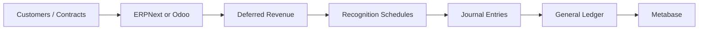
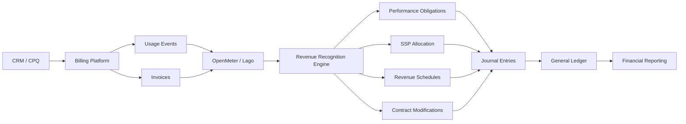

<div align="center">



# 💰 Awesome Revenue Recognition Software (ASC 606 & IFRS 15)

<a href="https://github.com/ishandutta2007/Awesome-Awesome-Awesome"></a><a href="https://discord.gg/jc4xtF58Ve"></a>
[](https://github.com/ishandutta2007/Awesome-Revenue-Recognition-Software/stargazers)
[](https://github.com/ishandutta2007/Awesome-Revenue-Recognition-Software/network/members)
[](LICENSE)
[](https://github.com/ishandutta2007/Awesome-Revenue-Recognition-Software/commits/main)
<a href="https://github.com/ishandutta2007"></a>

<p align="center">
  <strong>The definitive, SEO-optimized curated directory of enterprise SaaS revenue platforms, deferred revenue waterfall engines, ASC 606 / IFRS 15 contract accounting suites, Standalone Selling Price (SSP) allocation tools, and open-source financial ledgers.</strong>
</p>

---

</div>

## 💰 Top Revenue Recognition & Accounting Software

> 📊 A comprehensive, SEO-optimized directory of **Revenue Recognition, Revenue Accounting, Deferred Revenue, Contract Accounting, Subscription Billing, ASC 606, IFRS 15, SSP Allocation, Revenue Scheduling, and Revenue Automation platforms** — with a dedicated emphasis on **open-source and self-hosted alternatives**.

Revenue recognition software automates the accounting treatment of customer contracts, subscriptions, invoices, performance obligations (POBs), deferred revenue waterfalls, contract modifications, standalone selling price (SSP) allocation, revenue schedules, automated journal entries, and financial audit reporting.

This repository tracks commercial leaders (**Microsoft Dynamics 365, Oracle Revenue Management, NetSuite ARM, Salesforce Revenue Cloud, SAP RAR, Stripe Billing, Workday, Zuora, Chargebee RevRec, Maxio, Leapfin, Trullion**) alongside **open-source building blocks** (**Odoo, ERPNext, Hyperswitch, Lago, Polar, Kill Bill, OpenMeter, Firefly III, Invoice Ninja, Formance Ledger, OpenBooks**).

## 📑 Table of Contents

* [🏢 SaaS & Hosted RevRec Platforms](#-saashosted-platforms)
* [💻 Open-Source Ecosystem](#-open-source)
  * [1. Direct Revenue Recognition / Accounting](#1-direct-revenue-recognition--accounting)
  * [2. Open-Source ERP & Accounting Ledgers](#2-open-source-erp--accounting)
  * [3. Open-Source Billing & Monetization Engines](#3-open-source-billing--monetization)
  * [4. Revenue Recognition Engines & Projects](#4-revenue-recognition-engines--projects)
  * [5. Invoicing, Receivables & Financial Ledgers](#5-invoicing--receivables)
  * [6. Data & Workflow Infrastructure](#6-data--workflow-infrastructure)
  * [7. Analytics & Reporting](#7-analytics--reporting)
  * [8. AI & Document Processing](#8-ai--document-processing)
* [🔄 Commercial → Open-Source Mapping](#-commercial--open-source-mapping)
* [🏗️ Reference Architectures](#️-reference-architectures)
* [📊 Revenue Recognition Workflow](#-revenue-recognition-workflow)
* [🧮 Revenue Recognition Model](#-revenue-recognition-model)
* [📋 Capability Matrix](#-capability-matrix)
* [⭐ Recommended Open-Source Stacks](#-recommended-open-source-stacks)
* [🎯 Closest Open-Source Alternatives](#-closest-open-source-alternatives)
* [⚠️ What Open Source Can and Cannot Replace](#️-what-open-source-can-and-cannot-replace)
* [🔐 Security, Audit & Compliance](#-security-audit--compliance)
* [📜 Licensing](#-licensing)
* [🚀 Building a Self-Hosted Revenue Recognition Platform](#-building-a-self-hosted-revenue-recognition-platform)
* [📈 Star History](#-star-history)
* [🤝 Contributing](#-contributing)
* [⚠️ Disclaimer](#️-disclaimer)

---

# 🏢 SaaS/Hosted Platforms

These are commercial platforms that provide dedicated revenue-recognition, revenue-accounting, billing, subscription, or financial-management capabilities.

> **Market Size & Industry Structure:** The global Revenue Recognition, Billing, and Subscription Management software market is estimated at **~$4.5 Billion in 2025** and projected to surpass **~$10.8 Billion by 2032** (CAGR ~12.8%). The sector is **moderately to highly fragmented** rather than a winner-take-all market: enterprise mega-vendors (Microsoft, Oracle, SAP, Salesforce, Workday) anchor core GLs for Fortune 500 conglomerates, while specialized agile RevRec engines (Zuora, Chargebee, Maxio, RightRev, Leapfin, Trullion) capture high-growth SaaS, consumption pricing, and complex ASC 606/IFRS 15 compliance.

| Platform | Company Size (Valuation / MktCap / Revenue) | Primary Strength | Typical Use Case | Pricing (Starting Tier) | Free Tier / Free Trial Limits |
| :--- | :--- | :--- | :--- | :--- | :--- |
| [Microsoft Dynamics 365 Finance](https://www.microsoft.com/dynamics-365/products/finance) | **~$3.1 Trillion** MktCap / ~$245B+ Annual Revenue *(Nasdaq: MSFT)* | Financial accounting | Enterprise ERP | **$210/user/month** (Base license with Revenue Recognition included; Team Member licenses from $8/user/month) | **30-day free trial** with full cloud sandbox access, sample financial datasets, and preconfigured workflows (no credit card required) |
| [Oracle Revenue Management](https://www.oracle.com/erp/financials/revenue-management/) | **~$450 Billion** MktCap / ~$53B+ Annual Revenue *(NYSE: ORCL)* | Enterprise revenue | Large enterprises | **$175–$500/user/month** (Cloud license starting tier, ~$2,000/month baseline organization minimum) | **30-day Oracle Cloud Free Tier** with $300 cloud credits + guided demo sandbox |
| [Oracle NetSuite ARM](https://www.netsuite.com/) | **~$450 Billion** MktCap / ~$53B+ Annual Revenue *(Parent: Oracle)* | Advanced Revenue Management | ERP-integrated RevRec | Starts at **$500–$1,500/month** (ARM add-on module fee, over NetSuite base ERP starting at $999/month + $99/user/month) | **14-day NetSuite guided product tour / interactive sandbox demo** via sales consultation |
| [NetSuite Advanced Revenue Management](https://www.netsuite.com/) | **~$450 Billion** MktCap / ~$53B+ Annual Revenue *(Parent: Oracle)* | ERP RevRec | NetSuite customers | Starts at **$500–$1,500/month** (ARM add-on module fee, over NetSuite base ERP starting at $999/month + $99/user/month) | **14-day NetSuite guided product tour / interactive sandbox demo** via sales consultation |
| [Salesforce Revenue Cloud](https://www.salesforce.com/) | **~$270 Billion** MktCap / ~$35B+ Annual Revenue *(NYSE: CRM)* | Quote-to-cash | Salesforce-centric organizations | **$200/user/month** (Revenue Cloud Advanced starting tier, billed annually; CPQ starts at $75/user/month) | **30-day trial** via Salesforce Demo Org (SDO) upon sales consultation |
| [SAP Revenue Accounting and Reporting](https://www.sap.com/) | **~$260 Billion** MktCap / ~$35B+ Annual Revenue *(NYSE: SAP)* | Enterprise RevRec | SAP environments | Starts at **~$3,500/month** (~$42,000/year S/4HANA Cloud RAR baseline) | **14-day free guided evaluation** on SAP BTP / SAP S/4HANA Cloud Trial environment |
| [Stripe Billing](https://stripe.com/billing) | **~$70 Billion** Valuation *(Privately held, ~$4B+ Net Revenue)* | Billing infrastructure | SaaS and internet businesses | **$0/month base + 0.7%** per recurring transaction (Stripe RevRec module adds 0.4%) | **Permanent Free Tier:** Unlimited free test mode / developer sandbox with simulated charges and webhooks; 30-day free trial for live Revenue Recognition |
| [Workday Revenue Management](https://www.workday.com/) | **~$65 Billion** MktCap / ~$7.3B+ Annual Revenue *(Nasdaq: WDAY)* | Enterprise finance | Large organizations | Starts at **~$8,333/month** (~$100,000/year minimum contract value; ~$100–$200/employee/month) | **14-day guided sandbox proof-of-concept evaluation** upon enterprise consultation |
| [Sage Intacct](https://www.sage.com/en-us/products/sage-intacct/) | **~$15 Billion** MktCap / ~$2.8B+ Annual Revenue *(LSE: SGE)* | Financial management | Mid-market accounting | Starts at **~$750/month** (~$9,000–$12,000/year base configuration) | **30-day interactive guided product tour / sandbox environment** upon sales consultation |
| [Chargebee RevRec](https://www.chargebee.com/revrec/) | **~$3.5 Billion** Valuation *(Privately held, backed by Tiger Global & Accel)* | Subscription revenue | SaaS/subscription companies | **$599/month** (Performance plan base + RevRec module, billed $7,188/year; includes up to $100k/mo MRR + 0.75% overage) | **Permanent Free Tier (Starter Plan):** Free up to $250,000 cumulative lifetime billing (0.75% overage thereafter); 14-day free trial on Performance plan |
| [Zuora Revenue](https://www.zuora.com/products/revenue/) | **~$1.5 Billion** MktCap / Valuation *(NYSE: ZUO / Private Equity)* | Enterprise RevRec | Complex subscription businesses | Starts at **~$2,083/month** (~$25,000/year minimum platform commitment) | **30-day sandbox trial environment** upon demo qualification |
| [Zuora Billing](https://www.zuora.com/products/billing/) | **~$1.5 Billion** MktCap / Valuation *(NYSE: ZUO / Private Equity)* | Subscription billing | Enterprise SaaS | Starts at **~$2,083/month** (~$25,000/year Growth edition minimum platform fee) | **30-day sandbox trial environment** upon demo qualification |
| [Zuora RevPro / Zuora Revenue](https://www.zuora.com/) | **~$1.5 Billion** MktCap / Valuation *(NYSE: ZUO / Private Equity)* | Revenue accounting | Complex contracts | Starts at **~$2,083/month** (~$25,000/year minimum platform commitment) | **30-day sandbox trial environment** upon demo qualification |
| [Certinia](https://www.certinia.com/) | **~$1.0+ Billion** Valuation *(Acquired by Haveli Investments & General Atlantic)* | ERP + RevRec | Professional services | **$100–$350/user/month** (Core ERP/RevRec license, ~$1,500/month minimum base) | **14-day guided proof-of-concept sandbox** on Salesforce AppExchange via demo request |
| [BillingPlatform](https://billingplatform.com/) | **~$500 Million+** Valuation *(Privately held, backed by Columbia Capital & FTV)* | Enterprise billing | Complex monetization | Starts at **~$1,500/month** (~$18,000/year entry baseline) | **14-day free trial** ("Test Drive" interactive sandbox with monetization workflows) |
| [Maxio](https://www.maxio.com/) | **~$400 Million** Valuation *(Formed by SaaSOptics & Chargify merger, Battery Ventures)* | SaaS finance | Subscription finance and RevRec | **$599/month** (Grow plan for up to $100,000/month billings) | **Permanent Free Tier (Build Plan):** $0/month unlimited sandbox for API testing and workflow setup; 30-day free trial on Grow plan |
| [Maxio RevRec](https://www.maxio.com/) | **~$400 Million** Valuation *(Formed by SaaSOptics & Chargify merger, Battery Ventures)* | SaaS revenue recognition | B2B SaaS | **$599/month** (Grow plan covering up to $100k/month billings with RevRec engine included) | **Permanent Free Tier (Build Plan):** $0/month unlimited sandbox for API testing and workflow setup; 30-day free trial on Grow plan |
| [Recurly](https://recurly.com/) | **~$300 Million** Valuation *(Acquired by Accel-KKR)* | Subscription billing | Recurring-revenue businesses | **$249/month + 0.9%** (Starter plan; includes first $40,000/month billing volume) | **90-day free trial** on Starter plan with up to $40,000/month billing processing included (no credit card required) |
| [Trullion](https://trullion.com/) | **~$150–$200 Million** Valuation *(Series B backed by StepStone Group & Aleph)* | AI revenue accounting | Contract and revenue accounting | Starts at **~$250/month** (~$3,000/year entry tier for basic contract parsing) | **14-day free trial** on sandbox environment upon demo request |
| [Zenskar](https://www.zenskar.com/) | **~$100 Million** Valuation *(Series A backed by Bessemer Venture Partners)* | Billing + revenue | Complex usage and subscription models | Starts at **~$1,667/month** (~$20,000/year Starter tier baseline) | **14-day guided sandbox pilot** upon demo consultation |
| [Softrax](https://www.softrax.com/) | **~$75–$100 Million** Valuation *(Enterprise RevRec division of AFS Technologies)* | Revenue management | Enterprise revenue automation | Starts at **~$420/month** (~$5,000/year entry baseline) | **14-day guided proof-of-concept sandbox evaluation** via demo request |
| [Softrax Revenue Management](https://www.softrax.com/) | **~$75–$100 Million** Valuation *(Enterprise RevRec division of AFS Technologies)* | Contract revenue | Enterprise RevRec | Starts at **~$420/month** (~$5,000/year entry baseline for Revenue Manager module) | **14-day guided proof-of-concept sandbox evaluation** via demo request |
| [Leapfin](https://www.leapfin.com/) | **~$60–$80 Million** Valuation *(Series A/B backed by Crosslink Capital)* | Revenue automation | High-volume SaaS and transaction businesses | Starts at **~$1,000/month** (~$12,000/year base platform) | **14-day guided proof-of-concept sandbox trial** via sales consultation |
| [Ordway](https://ordwaylabs.com/) | **~$50–$70 Million** Valuation *(Series A backed by Menor & Columbia Capital)* | Billing + RevRec | Complex billing | Starts at **$500/month** (~$6,000/year baseline tier) | **14-day personalized sandbox pilot** upon sales demo consultation |
| [Moesif](https://www.moesif.com/) | **~$40–$60 Million** Valuation *(Series A backed by Merus Capital)* | Usage analytics | API/usage businesses | **$0/month** (Free plan; paid Grow plan starts at **$100/month** for 1M events) | **Permanent Free Tier:** Up to 50,000 API events/month with 3 team seats; 14-day free trial on Grow/Pro plans (no credit card required) |
| [RightRev](https://www.rightrev.com/) | **~$30–$50 Million** Valuation *(Backed by Norwest & Salesforce Ventures)* | Revenue recognition | ASC 606 / IFRS 15 | **$2,500/month** (~$30,000/year entry tier on Salesforce AppExchange) | **14-day guided proof-of-concept sandbox trial** upon sales consultation |
| [Chargezoom](https://www.chargezoom.com/) | **~$25–$40 Million** Valuation *(Backed by SaaS Venture Capital)* | Billing / AR | SMB and mid-market | **$0/month** (Free plan; paid Plus plan starts at **$95/month** for $150K annual processing) | **Permanent Free Tier:** $0/month always-free plan with up to 5 users, unlimited co-branded e-invoicing & payment links, and 2-way sync; 30-day free trial on Plus plan |
| [Sequence](https://www.sequencehq.com/) | **~$25–$35 Million** Valuation *(Seed/Series A backed by a16z)* | Billing / monetization | Modern SaaS and usage-based businesses | **$799/month** (Growth plan for up to $1M annual revenue) | **14-day interactive sandbox access** via dashboard.sandbox.sequencehq.com |
| [HubiFi](https://www.hubifi.com/) | **~$15–$25 Million** Valuation *(Privately held early-stage automation)* | Revenue automation | Transaction-heavy businesses | Starts at **~$1,833/month** (~$22,000/year entry baseline) | **14-day guided sandbox pilot / proof-of-concept** upon sales evaluation |

---

# 💻 Open-Source

> **Open-source is the primary focus of this repository.**
>
> A critical distinction is necessary: an open-source billing system is **not automatically an ASC 606/IFRS 15 revenue-recognition system**. Billing determines what is invoiced; revenue recognition determines **when and how revenue is earned and recorded**.
>
> The projects below are therefore grouped by how directly they can replace or contribute to a commercial RevRec platform.

---

# 1. Direct Revenue Recognition / Accounting

*Open-source platforms providing automated revenue recognition, deferred revenue scheduling, contract accounting, and general ledger journal entries, ranked by GitHub Star Count (descending).*

## 🥇 [Odoo Community](https://github.com/odoo/odoo) [](https://github.com/odoo/odoo/stargazers)

Modular, full-stack open-source ERP with native double-entry accounting supporting automated deferred revenue models and recognition schedules.

### ⚡ Revenue capabilities

* Deferred revenue models & periodic recognition
* Day/month prorated revenue schedules
* Automated GL journal entry generation
* Multi-company & multi-currency accounting
* Contract & subscription billing integration
* Balance sheet deferred revenue liability tracking
* Financial audit reports & general ledger

**GitHub:** https://github.com/odoo/odoo  
**Best for:** Modular ERP-centric revenue accounting and contract lifecycle automation.

---

## 🥈 [ERPNext](https://github.com/frappe/erpnext) [](https://github.com/frappe/erpnext/stargazers)

Comprehensive Python/Frappe open-source ERP featuring dedicated deferred revenue workflows, performance period schedules, and accounting automation.

### ⚡ Revenue capabilities

* Deferred revenue & deferred expense schedules
* Service date range allocation (day-based or month-based)
* Automated background recognition posting
* Sales invoice & subscription integration
* Contract asset and contract liability ledgering
* Accounts receivable (AR) and payment reconciliations
* REST API & webhooks for external billing systems

**GitHub:** https://github.com/frappe/erpnext  
**Best for:** End-to-end open-source subscription and deferred revenue management.

---

## 🥉 [Dolibarr](https://github.com/Dolibarr/dolibarr) [](https://github.com/Dolibarr/dolibarr/stargazers)

Mature PHP-based open-source ERP/CRM platform providing double-entry accounting, customer contracts, and recurring invoice scheduling.

### ⚡ Revenue capabilities

* Recurring service contracts & billing schedules
* Double-entry bookkeeping & chart of accounts
* Customer invoices, payments, and credit notes
* Extensible financial reporting and accounting export
* Modular REST API for external RevRec calculators

**GitHub:** https://github.com/Dolibarr/dolibarr  
**Best for:** Lightweight accounting foundation for SMB and custom billing architectures.

---

## 🌟 [Tryton](https://github.com/tryton/tryton) [](https://github.com/tryton/tryton/stargazers)

Highly modular, Python-powered enterprise accounting and ERP framework engineered for precision bookkeeping.

### ⚡ Relevant components

* Double-entry bookkeeping with strict audit controls
* Multi-currency accounts receivable & general ledger
* Invoicing, contract schedules, and tax rules
* Modular architecture ideal for custom ASC 606 rule modules

**GitHub:** https://github.com/tryton/tryton  
**Best for:** Developers building strictly compliant custom financial backends.

---

## 🌟 [OpenBooks](https://github.com/braedonsaunders/openbooks) [](https://github.com/braedonsaunders/openbooks/stargazers)

Open-source financial management platform purpose-built around modern revenue-contract accounting and ASC 606 / IFRS 15 compliance.

### ⚡ Relevant capabilities

* Multi-obligation revenue contracts
* Performance obligations (POBs) tracking
* Point-in-time & over-time recognition schedules
* Cumulative catch-up adjustments upon contract modification
* Cancellation, returns, and refund liability handling
* Double-entry general ledger posting
* Automated ASC 606 conformance testing suite

**GitHub:** https://github.com/braedonsaunders/openbooks  
**Status:** Alpha — evaluate carefully for production financial workflows.

---

# 2. Open-Source ERP & Accounting

These platforms form the **general-ledger / accounting foundation** beneath a custom revenue-recognition and deferred-schedule engine, ranked by GitHub Star Count (descending).

| Project | GitHub Stars | Accounting | Invoicing | Contracts | RevRec Capability | License |
| :--- | :--- | :---: | :---: | :---: | :---: | :--- |
| **[Odoo Community](https://github.com/odoo/odoo)** | [](https://github.com/odoo/odoo/stargazers) | ✅ | ✅ | ✅ | ⭐⭐⭐⭐ | LGPL-3.0 |
| **[ERPNext](https://github.com/frappe/erpnext)** | [](https://github.com/frappe/erpnext/stargazers) | ✅ | ✅ | ✅ | ⭐⭐⭐⭐ | GPL-3.0 |
| **[Dolibarr](https://github.com/Dolibarr/dolibarr)** | [](https://github.com/Dolibarr/dolibarr/stargazers) | ✅ | ✅ | ✅ | ⭐⭐⭐ | GPL-3.0 |
| **[GnuCash](https://github.com/Gnucash/gnucash)** | [](https://github.com/Gnucash/gnucash/stargazers) | ✅ | Limited | Limited | ⭐ | GPL-2.0 |
| **[metasfresh](https://github.com/metasfresh/metasfresh)** | [](https://github.com/metasfresh/metasfresh/stargazers) | ✅ | ✅ | ✅ | ⭐⭐⭐ | GPL-2.0 |
| **[Apache OFBiz](https://github.com/apache/ofbiz-framework)** | [](https://github.com/apache/ofbiz-framework/stargazers) | ✅ | ✅ | ✅ | ⭐⭐⭐ | Apache-2.0 |
| **[Axelor Open Suite](https://github.com/axelor/axelor-open-suite)** | [](https://github.com/axelor/axelor-open-suite/stargazers) | ✅ | ✅ | ✅ | ⭐⭐⭐ | AGPL-3.0 |
| **[ADempiere](https://github.com/adempiere/adempiere)** | [](https://github.com/adempiere/adempiere/stargazers) | ✅ | ✅ | ✅ | ⭐⭐⭐ | GPL-2.0 |
| **[iDempiere](https://github.com/idempiere/idempiere)** | [](https://github.com/idempiere/idempiere/stargazers) | ✅ | ✅ | ✅ | ⭐⭐⭐ | GPL-2.0 |
| **[LedgerSMB](https://github.com/ledgersmb/LedgerSMB)** | [](https://github.com/ledgersmb/LedgerSMB/stargazers) | ✅ | ✅ | Limited | ⭐⭐ | GPL-2.0 |
| **[Tryton](https://github.com/tryton/tryton)** | [](https://github.com/tryton/tryton/stargazers) | ✅ | ✅ | ✅ | ⭐⭐⭐ | GPL-3.0 |
| **[FrontAccounting](https://github.com/FrontAccountingERP/FA)** | [](https://github.com/FrontAccountingERP/FA/stargazers) | ✅ | ✅ | Limited | ⭐⭐ | GPL-3.0 |
| **[Nexedi ERP5](https://www.erp5.com/)** | — | ✅ | ✅ | ✅ | ⭐⭐⭐ | GPL-3.0 |

---

# 3. Open-Source Billing & Monetization

Billing engines supply the critical operational data feeding a RevRec engine: subscriptions, usage events, multi-tier pricing, invoices, credits, and cancellations. Ranked by GitHub Star Count (descending).

## 🌟 [Hyperswitch](https://github.com/juspay/hyperswitch) [](https://github.com/juspay/hyperswitch/stargazers)

High-performance, open-source financial payment router and orchestration platform written in Rust.

### ⚡ Features
* Multi-processor smart routing & failover
* Unified payment API across 50+ gateways
* Global payment methods (Cards, Wallets, Real-Time Rails)
* Reduced transaction fees and elevated conversion rates

**License:** Apache-2.0 | **GitHub:** https://github.com/juspay/hyperswitch

---

## 🌟 [Medusa](https://github.com/medusajs/medusa) [](https://github.com/medusajs/medusa/stargazers)

Modular, headless digital commerce and monetization platform built with Node.js and TypeScript.

### ⚡ Features
* Subscription workflows and recurring billing modules
* Multi-currency product catalogs & tax calculations
* Flexible promotion engines, coupons, and customer portals
* Event-driven architecture with Redis / PostgreSQL

**License:** MIT | **GitHub:** https://github.com/medusajs/medusa

---

## 🌟 [Lago](https://github.com/getlago/lago) [](https://github.com/getlago/lago/stargazers)

Open-source metering and usage-based billing infrastructure built for modern SaaS.

### ⚡ Features
* High-volume consumption metering & usage aggregation
* Complex hybrid subscription models (flat fee + per-unit)
* Prepaid credits, minimum spend commitments, and coupons
* Automated invoicing and real-time billing webhooks

**License:** AGPL-3.0 | **GitHub:** https://github.com/getlago/lago

---

## 🌟 [Polar](https://github.com/polarsource/polar) [](https://github.com/polarsource/polar/stargazers)

Open-source developer monetization platform for SaaS, API subscriptions, and digital products.

### ⚡ Features
* Tiered subscription plans, pay-what-you-want, and usage meters
* Built-in customer checkout, license key generation, and webhooks
* Merchant of Record (MoR) and self-hosted direct integration modes
* Fast modern UI and developer-first APIs

**License:** Apache-2.0 | **GitHub:** https://github.com/polarsource/polar

---

## 🌟 [Kill Bill](https://github.com/killbill/killbill) [](https://github.com/killbill/killbill/stargazers)

Enterprise-grade open-source subscription billing and payments management platform.

### ⚡ Features
* Complex subscription lifecycle and dunning management
* Add-ons, plan transitions, proration, and trial handling
* Extensible plugin architecture (custom tax, payment gateways, analytics)
* Real-time billing bus event streaming

**License:** Apache-2.0 | **GitHub:** https://github.com/killbill/killbill

---

## 🌟 [OpenMeter](https://github.com/openmeterio/openmeter) [](https://github.com/openmeterio/openmeter/stargazers)

Cloud-native open-source metering infrastructure designed for AI, API, and consumption-based products.

### ⚡ Features
* Sub-millisecond CloudEvents ingestion pipeline
* Real-time usage aggregation windowing with ClickHouse
* Entitlements enforcement and prepaid credit balance tracking
* Native integration with Stripe Billing and custom ledger workflows

**License:** Apache-2.0 | **GitHub:** https://github.com/openmeterio/openmeter

---

## 🌟 [Meteroid](https://github.com/meteroid-oss/meteroid) [](https://github.com/meteroid-oss/meteroid/stargazers)

Open-source pricing and monetization platform supporting usage-based billing and customer quoting.

### ⚡ Features
* Real-time usage event metering
* Multi-dimensional pricing matrices & hybrid subscriptions
* Quoting, invoicing, and credit notes management
* Accounting sync hooks

**License:** AGPL-3.0 | **GitHub:** https://github.com/meteroid-oss/meteroid

---

## 📊 Comprehensive Billing & Monetization Comparison

| Project | GitHub Stars | Primary Role | License |
| :--- | :--- | :--- | :--- |
| **[Hyperswitch](https://github.com/juspay/hyperswitch)** | [](https://github.com/juspay/hyperswitch/stargazers) | Payment orchestration switch & multi-rail routing | Apache-2.0 |
| **[Medusa](https://github.com/medusajs/medusa)** | [](https://github.com/medusajs/medusa/stargazers) | Headless commerce, subscription & digital checkout | MIT |
| **[Saleor](https://github.com/saleor/saleor)** | [](https://github.com/saleor/saleor/stargazers) | High-scale GraphQL commerce & monetization | BSD-3-Clause |
| **[Lago](https://github.com/getlago/lago)** | [](https://github.com/getlago/lago/stargazers) | Usage-based metering & hybrid subscription billing | AGPL-3.0 |
| **[Polar](https://github.com/polarsource/polar)** | [](https://github.com/polarsource/polar/stargazers) | Developer monetization, subscriptions & licensing | Apache-2.0 |
| **[Kill Bill](https://github.com/killbill/killbill)** | [](https://github.com/killbill/killbill/stargazers) | Enterprise recurring billing & subscription state machine | Apache-2.0 |
| **[Solidus](https://github.com/solidusio/solidus)** | [](https://github.com/solidusio/solidus/stargazers) | Modular Ruby on Rails commerce framework | BSD-3-Clause |
| **[OpenMeter](https://github.com/openmeterio/openmeter)** | [](https://github.com/openmeterio/openmeter/stargazers) | Real-time CloudEvents usage metering & consumption pipeline | Apache-2.0 |
| **[Meteroid](https://github.com/meteroid-oss/meteroid)** | [](https://github.com/meteroid-oss/meteroid/stargazers) | Usage monetization, pricing schemes & invoicing | AGPL-3.0 |
| **[Tier](https://github.com/tierrun/tier)** | [](https://github.com/tierrun/tier/stargazers) | Pricing and entitlement SDK for software SaaS | BSD-3-Clause |

---

# 4. Revenue Recognition Engines & Projects

Dedicated open-source calculation code, reference implementations, and accounting rules for ASC 606 and IFRS 15. Ranked by GitHub Star Count (descending).

## 🌟 [OpenAccountants](https://github.com/openaccountants/openaccountants) [](https://github.com/openaccountants/openaccountants/stargazers)

Open-source financial knowledge base and rule automation repository covering international accounting standards.

### ⚡ Capabilities & Rules
* Performance obligation identification
* Transaction price allocation based on Standalone Selling Price (SSP)
* Variable consideration & constraint calculations
* Contract modifications (prospective vs. cumulative catch-up)
* Contract asset, contract liability, and refund liability formulas

**GitHub:** https://github.com/openaccountants/openaccountants

---

## 🌟 [OpenBooks Revenue Engine](https://github.com/braedonsaunders/openbooks) [](https://github.com/braedonsaunders/openbooks/stargazers)

The core RevRec engine implementation from the OpenBooks project.

### ⚡ Capabilities
* Multi-period recognition schedules
* Point-in-time vs. over-time milestone completion
* Automated journal entry generator
* Standards conformance validation test suite

**GitHub:** https://github.com/braedonsaunders/openbooks

---

## 🌟 [Revenue Recognition — C#](https://github.com/jonsb/revenue-recognition) [](https://github.com/jonsb/revenue-recognition/stargazers)

C# implementation of enterprise revenue recognition domain models based on Martin Fowler's *Patterns of Enterprise Application Architecture*.

### ⚡ Capabilities
* Three-way contract revenue distribution models
* Domain logic for time-based amortization
* Software architecture reference for financial state machines

**GitHub:** https://github.com/jonsb/revenue-recognition

---

# 5. Invoicing, Receivables & Ledgers

Invoicing platforms, double-entry tracking suites, and programmable financial ledgers that provide AR transactions and customer balances. Ranked by GitHub Star Count (descending).

| Project | GitHub Stars | Primary Capability | Tech Stack | License |
| :--- | :--- | :--- | :--- | :--- |
| **[Firefly III](https://github.com/firefly-iii/firefly-iii)** | [](https://github.com/firefly-iii/firefly-iii/stargazers) | Double-entry financial bookkeeping & balance tracking | PHP / Laravel | AGPL-3.0 |
| **[Akaunting](https://github.com/akaunting/akaunting)** | [](https://github.com/akaunting/akaunting/stargazers) | Small business invoicing, payments & accounting | PHP / Laravel | GPL-3.0 |
| **[Invoice Ninja](https://github.com/invoiceninja/invoiceninja)** | [](https://github.com/invoiceninja/invoiceninja/stargazers) | Professional invoicing, recurring payments & client portal | PHP / Flutter | AGPL-3.0 |
| **[Crater](https://github.com/crater-invoice-inc/crater)** | [](https://github.com/crater-invoice-inc/crater/stargazers) | Modern invoicing and expense tracking platform | PHP / Vue | AGPL-3.0 |
| **[BigCapital](https://github.com/bigcapitalhq/bigcapital)** | [](https://github.com/bigcapitalhq/bigcapital/stargazers) | Double-entry accounting, customer billing & financial reporting | TypeScript / Node | AGPL-3.0 |
| **[InvoicePlane](https://github.com/InvoicePlane/InvoicePlane)** | [](https://github.com/InvoicePlane/InvoicePlane/stargazers) | Lightweight self-hosted invoicing & client management | PHP | MIT |
| **[InvoiceShelf](https://github.com/InvoiceShelf/InvoiceShelf)** | [](https://github.com/InvoiceShelf/InvoiceShelf/stargazers) | Modern self-hosted invoicing and billing portal | PHP / Vue | AGPL-3.0 |
| **[Formance Ledger](https://github.com/formancehq/ledger)** | [](https://github.com/formancehq/ledger/stargazers) | Programmable multi-asset ledger for money movement & revenue flows | Go | Apache-2.0 |
| **[Midaz](https://github.com/lerianstudio/midaz)** | [](https://github.com/lerianstudio/midaz/stargazers) | High-scale transaction ledger & accounting ledger engine | Go | Apache-2.0 |
| **[GOBL (Invopop)](https://github.com/invopop/gobl)** | [](https://github.com/invopop/gobl/stargazers) | Global Open Business Language: JSON electronic invoice schemas | Go | Apache-2.0 |

---

# 6. Data & Workflow Infrastructure

A production-grade RevRec platform requires resilient workflow orchestration, high-integrity financial databases, and streaming pipelines. Ranked by GitHub Star Count (descending).

## ⚙️ Workflow Orchestration

| Project | GitHub Stars | Architectural Role in RevRec |
| :--- | :--- | :--- |
| **[n8n](https://github.com/n8n-io/n8n)** | [](https://github.com/n8n-io/n8n/stargazers) | Visual integration workflows connecting CRM, Billing, and Ledgers |
| **[Apache Airflow](https://github.com/apache/airflow)** | [](https://github.com/apache/airflow/stargazers) | Scheduled batch RevRec calculation DAGs, waterfalls & reconciliation |
| **[Kestra](https://github.com/kestra-io/kestra)** | [](https://github.com/kestra-io/kestra/stargazers) | Declarative event-driven data orchestrator for financial pipelines |
| **[Prefect](https://github.com/PrefectHQ/prefect)** | [](https://github.com/PrefectHQ/prefect/stargazers) | Pythonic dataflow automation for nightly deferred revenue amortization |
| **[Node-RED](https://github.com/node-red/node-red)** | [](https://github.com/node-red/node-red/stargazers) | Real-time event routing for webhook ingestion |
| **[Temporal](https://github.com/temporalio/temporal)** | [](https://github.com/temporalio/temporal/stargazers) | Resilient, distributed state machines for multi-month contract lifecycle |
| **[Windmill](https://github.com/windmill-labs/windmill)** | [](https://github.com/windmill-labs/windmill/stargazers) | High-performance developer workflows, scripts, and internal finance apps |
| **[Dagster](https://github.com/dagster-io/dagster)** | [](https://github.com/dagster-io/dagster/stargazers) | Asset-based data orchestrator tracking financial data lineage |

---

## 🗄️ Financial Databases

| Project | GitHub Stars | Storage Role in RevRec |
| :--- | :--- | :--- |
| **[Redis](https://github.com/redis/redis)** | [](https://github.com/redis/redis/stargazers) | High-speed cache for entitlement states and real-time usage meters |
| **[ClickHouse](https://github.com/ClickHouse/ClickHouse)** | [](https://github.com/ClickHouse/ClickHouse/stargazers) | Ultra-fast column store for raw metering events and revenue waterfall analytics |
| **[DuckDB](https://github.com/duckdb/duckdb)** | [](https://github.com/duckdb/duckdb/stargazers) | Embedded OLAP analytics for in-process financial reporting and modeling |
| **[PostgreSQL](https://github.com/postgres/postgres)** | [](https://github.com/postgres/postgres/stargazers) | ACID-compliant primary financial database for contracts, schedules, and GL |
| **[MySQL](https://github.com/mysql/mysql-server)** | [](https://github.com/mysql/mysql-server/stargazers) | High-volume relational transaction storage |
| **[SQLite](https://github.com/sqlite/sqlite)** | [](https://github.com/sqlite/sqlite/stargazers) | Embedded lightweight storage for local testing and micro-engines |
| **[MariaDB](https://github.com/MariaDB/server)** | [](https://github.com/MariaDB/server/stargazers) | Enterprise open relational database |

---

## ⚡ Event Streaming

| Project | GitHub Stars | Streaming Role in RevRec |
| :--- | :--- | :--- |
| **[Apache Kafka](https://github.com/apache/kafka)** | [](https://github.com/apache/kafka/stargazers) | Enterprise event streaming backbone for billing events and journal changes |
| **[NATS](https://github.com/nats-io/nats-server)** | [](https://github.com/nats-io/nats-server/stargazers) | Ultra-low latency cloud-native pub/sub for real-time usage meters |
| **[Apache Pulsar](https://github.com/apache/pulsar)** | [](https://github.com/apache/pulsar/stargazers) | Multi-tenant event streaming with tiered offload storage |
| **[RabbitMQ](https://github.com/rabbitmq/rabbitmq-server)** | [](https://github.com/rabbitmq/rabbitmq-server/stargazers) | Message broker for reliable asynchronous accounting task queues |
| **[Redpanda](https://github.com/redpanda-data/redpanda)** | [](https://github.com/redpanda-data/redpanda/stargazers) | C++ Kafka-compatible streaming engine with zero JVM overhead |

---

# 7. Analytics & Reporting

A robust RevRec platform requires deep reporting for deferred revenue waterfalls, contract liabilities, cohort ARR, remaining performance obligations (RPO), and audit reconciliation. Ranked by GitHub Star Count (descending).

| Project | GitHub Stars | Reporting & Analytics Role |
| :--- | :--- | :--- |
| **[Grafana](https://github.com/grafana/grafana)** | [](https://github.com/grafana/grafana/stargazers) | Real-time financial operational monitoring, event throughput & audit metrics |
| **[Apache Superset](https://github.com/apache/superset)** | [](https://github.com/apache/superset/stargazers) | Enterprise BI exploration, deferred revenue waterfall charts & SQL queries |
| **[Metabase](https://github.com/metabase/metabase)** | [](https://github.com/metabase/metabase/stargazers) | Intuitive business dashboards for revenue by product, customer, and cohort |
| **[ClickHouse](https://github.com/ClickHouse/ClickHouse)** | [](https://github.com/ClickHouse/ClickHouse/stargazers) | Real-time analytics engine backing multi-million row revenue queries |
| **[OpenSearch](https://github.com/opensearch-project/OpenSearch)** | [](https://github.com/opensearch-project/OpenSearch/stargazers) | Full-text searchable audit log trails, compliance histories & event archives |
| **[Apache Pinot](https://github.com/apache/pinot)** | [](https://github.com/apache/pinot/stargazers) | Real-time distributed OLAP datastore for immediate revenue event analytics |

---

# 8. AI & Document Processing

AI, OCR, and Document Vision models extract contractual terms (customer, dates, products, discounts, termination clauses, performance obligations) before feeding into the RevRec accounting engine. Ranked by GitHub Star Count (descending).

| Project | GitHub Stars | Category | Role in Contract Revenue Ingestion |
| :--- | :--- | :--- | :--- |
| **[Ollama](https://github.com/ollama/ollama)** | [](https://github.com/ollama/ollama/stargazers) | LLM Runtime | Local inference runtime for private on-premises contract parsing |
| **[Transformers](https://github.com/huggingface/transformers)** | [](https://github.com/huggingface/transformers/stargazers) | ML Framework | State-of-the-art NLP models for legal clause classification & extraction |
| **[LangChain](https://github.com/langchain-ai/langchain)** | [](https://github.com/langchain-ai/langchain/stargazers) | Agent Framework | Orchestrating multi-step contract review & validation agent pipelines |
| **[llama.cpp](https://github.com/ggml-org/llama.cpp)** | [](https://github.com/ggml-org/llama.cpp/stargazers) | Inference Engine | High-speed C/C++ local model execution for contract token analysis |
| **[vLLM](https://github.com/vllm-project/vllm)** | [](https://github.com/vllm-project/vllm/stargazers) | High-Throughput Serving | High-throughput batch contract document parsing engine |
| **[OpenCV](https://github.com/opencv/opencv)** | [](https://github.com/opencv/opencv/stargazers) | Computer Vision | Image preprocessing, rotation correction, and de-noising of contract PDFs |
| **[PaddleOCR](https://github.com/PaddlePaddle/PaddleOCR)** | [](https://github.com/PaddlePaddle/PaddleOCR/stargazers) | Document OCR | Multi-lingual OCR for tables, line items, and invoice values |
| **[Tesseract](https://github.com/tesseract-ocr/tesseract)** | [](https://github.com/tesseract-ocr/tesseract/stargazers) | Optical Character Rec | Reliable text extraction from scanned PDF contracts |
| **[Docling](https://github.com/DS4SD/docling)** | [](https://github.com/DS4SD/docling/stargazers) | Document Parsing | Parses complex financial PDFs, extracts tables and structured JSON tokens |
| **[LlamaIndex](https://github.com/run-llama/llama_index)** | [](https://github.com/run-llama/llama_index/stargazers) | RAG Framework | Contract indexing and retrieval-augmented verification against accounting rules |
| **[Paperless-ngx](https://github.com/paperless-ngx/paperless-ngx)** | [](https://github.com/paperless-ngx/paperless-ngx/stargazers) | Document Management | Ingestion archive and OCR indexing for financial contracts and invoices |
| **[OCRmyPDF](https://github.com/ocrmypdf/OCRmyPDF)** | [](https://github.com/ocrmypdf/OCRmyPDF/stargazers) | PDF Pipeline | Converts scanned contract images into searchable PDF/A documents |
| **[Open3D](https://github.com/isl-org/Open3D)** | [](https://github.com/isl-org/Open3D/stargazers) | 3D Vision | Advanced spatial document alignment and structured layout rendering |

### Potential AI RevRec workflow

```text
Contract PDF
    │
    ▼
OCR / Document Parser
    │
    ▼
Contract Extraction
    │
    ├── Customer
    ├── Products
    ├── Dates
    ├── Prices
    ├── Discounts
    ├── Renewal Terms
    ├── Termination
    └── Performance Obligations
    │
    ▼
Revenue Recognition Rules
    │
    ▼
Recognition Engine
    │
    ▼
Revenue Schedule
    │
    ▼
Journal Entries
    │
    ▼
General Ledger
```

---

# 🔄 Commercial → Open-Source Mapping

| Commercial Platform           | Closest Open-Source Strategy                     |
| ----------------------------- | ------------------------------------------------ |
| **Leapfin**                   | OpenBooks + PostgreSQL + Airflow                 |
| **Zenskar**                   | Lago / Meteroid / OpenMeter + OpenBooks          |
| **Sequence**                  | OpenMeter + Lago + custom RevRec engine          |
| **Softrax**                   | OpenBooks + ERPNext/Odoo                         |
| **RightRev**                  | OpenBooks + custom ASC 606 engine                |
| **Chargebee RevRec**          | Lago/Kill Bill + OpenBooks/ERPNext               |
| **Zuora Revenue**             | OpenMeter/Lago + custom RevRec + ERP             |
| **Maxio**                     | Lago + ERPNext + custom revenue schedules        |
| **Sage Intacct RevRec**       | ERPNext / Odoo + custom RevRec                   |
| **Oracle Revenue Management** | OpenBooks + PostgreSQL + Kafka + workflow engine |
| **HubiFi**                    | Kafka + PostgreSQL + OpenBooks + dbt             |
| **Trullion**                  | OCR + LLM + OpenBooks + PostgreSQL               |
| **NetSuite ARM**              | ERPNext/Odoo + OpenBooks                         |
| **Custom RevRec SaaS**        | OpenBooks + OpenMeter + PostgreSQL               |

---

# 🏗️ Reference Architectures

## Architecture 1 — Simple Open-Source RevRec



---

## Architecture 2 — SaaS Revenue Recognition



---

# 📊 Revenue Recognition Workflow

```text
1. Contract Creation
        │
        ▼
2. Identify Customer & Contract
        │
        ▼
3. Identify Performance Obligations
        │
        ▼
4. Determine Transaction Price
        │
        ▼
5. Allocate Transaction Price
        │
        ▼
6. Determine Recognition Pattern
        │
        ├── Point-in-Time
        │
        └── Over-Time
        │
        ▼
7. Generate Revenue Schedule
        │
        ▼
8. Generate Journal Entries
        │
        ▼
9. Post to General Ledger
        │
        ▼
10. Reconcile
        │
        ▼
11. Financial Reporting
```

---

# 🧮 Revenue Recognition Model

A generalized ASC 606 / IFRS 15 engine can be represented as:

```text
Contract
   │
   ├── Customer
   ├── Contract Start
   ├── Contract End
   ├── Products
   ├── Pricing
   ├── Discounts
   └── Modifications
        │
        ▼
Performance Obligations
        │
        ▼
Transaction Price
        │
        ▼
SSP Allocation
        │
        ▼
Recognition Method
        │
        ├── Point-in-Time
        ├── Straight-Line
        ├── Usage-Based
        ├── Milestone
        ├── Output Method
        └── Input Method
        │
        ▼
Revenue Schedule
        │
        ▼
Journal Entries
```

---

# 📋 Capability Matrix

| Capability              | OpenBooks | Odoo | ERPNext | Kill Bill | Lago | OpenMeter | Custom Engine |
| ----------------------- | --------: | ---: | ------: | --------: | ---: | --------: | ------------: |
| General Ledger          |         ✅ |    ✅ |       ✅ |        ⚠️ |    ❌ |         ❌ |         Build |
| Invoicing               |         ✅ |    ✅ |       ✅ |         ✅ |    ✅ |         ✅ |         Build |
| Subscriptions           |         ✅ |    ✅ |       ✅ |         ✅ |    ✅ |         ✅ |         Build |
| Usage Billing           |        ⚠️ |   ⚠️ |      ⚠️ |         ✅ |    ✅ |         ✅ |         Build |
| Deferred Revenue        |         ✅ |    ✅ |       ✅ |        ⚠️ |   ⚠️ |        ⚠️ |         Build |
| Revenue Schedules       |         ✅ |    ✅ |       ✅ |        ⚠️ |   ⚠️ |        ⚠️ |         Build |
| Performance Obligations |         ✅ |   ⚠️ |      ⚠️ |         ❌ |    ❌ |         ❌ |         Build |
| SSP Allocation          |        ⚠️ |   ⚠️ |      ⚠️ |         ❌ |    ❌ |         ❌ |         Build |
| Contract Modification   |        ⚠️ |   ⚠️ |      ⚠️ |        ⚠️ |   ⚠️ |        ⚠️ |         Build |
| Catch-Up Entries        |         ✅ |   ⚠️ |      ⚠️ |         ❌ |    ❌ |         ❌ |         Build |
| ASC 606 Engine          |        ⚠️ |   ⚠️ |      ⚠️ |         ❌ |    ❌ |         ❌ |         Build |
| IFRS 15 Engine          |        ⚠️ |   ⚠️ |      ⚠️ |         ❌ |    ❌ |         ❌ |         Build |
| Journal Entries         |         ✅ |    ✅ |       ✅ |        ⚠️ |   ⚠️ |        ⚠️ |         Build |
| Audit Trail             |         ✅ |    ✅ |       ✅ |         ✅ |    ✅ |         ✅ |         Build |
| API                     |         ✅ |    ✅ |       ✅ |         ✅ |    ✅ |         ✅ |         Build |
| Self-Hosted             |         ✅ |    ✅ |       ✅ |         ✅ |    ✅ |         ✅ |             ✅ |

> `⚠️` indicates that the capability may require configuration, customization, an extension, or a separate component.

---

# ⭐ Recommended Open-Source Stacks

## 🥇 Stack A — Maximum Accounting Coverage

```text
ERPNext
   +
OpenBooks
   +
PostgreSQL
   +
Airflow
   +
Metabase
```

### Best for

* Finance departments
* SaaS companies
* Contract accounting
* Deferred revenue
* Custom revenue schedules
* Self-hosted accounting

---

## 🥈 Stack B — Modern Usage-Based SaaS

```text
OpenMeter
     +
PostgreSQL / ClickHouse
     +
Custom RevRec Engine
     +
OpenBooks
     +
Metabase
```

### Best for

* AI companies
* API businesses
* Usage-based SaaS
* Token-based pricing
* Consumption billing

---

## 🥉 Stack C — Subscription SaaS

```text
Kill Bill
   +
PostgreSQL
   +
Revenue Recognition Engine
   +
ERPNext
   +
Metabase
```

### Best for

* Recurring subscriptions
* Complex billing
* Large customer bases
* Multiple billing models

---

## Stack D — Fully Open-Source Modern Monetization

```text
OpenMeter
      │
      ▼
Kafka
      │
      ▼
Revenue Recognition Engine
      │
      ├── Contract Engine
      ├── SSP Engine
      ├── Allocation Engine
      ├── Schedule Engine
      └── Journal Engine
      │
      ▼
PostgreSQL
      │
      ▼
ERPNext / OpenBooks
      │
      ▼
Metabase
```

---

# 🎯 Closest Open-Source Alternatives

## Alternative to Leapfin

### Recommended

```text
OpenBooks
+
PostgreSQL
+
Airflow
+
Metabase
```

Best suited for transaction transformation and revenue-accounting automation.

---

## Alternative to Zenskar

### Recommended

```text
OpenMeter
+
Lago
+
OpenBooks
```

Particularly strong for:

* Usage billing
* Hybrid pricing
* Subscription monetization
* Revenue automation

---

## Alternative to Chargebee RevRec

### Recommended

```text
Lago
+
OpenBooks
+
ERPNext
```

---

## Alternative to Zuora Revenue

### Recommended

```text
OpenMeter / Kill Bill
          +
Custom Revenue Engine
          +
OpenBooks / ERPNext
          +
PostgreSQL
```

This is a **platform architecture rather than a single drop-in replacement**.

---

## Alternative to NetSuite ARM

### Recommended

```text
ERPNext
+
OpenBooks
+
Custom Revenue Recognition Module
```

---

## Alternative to RightRev

### Recommended

```text
OpenBooks
+
Custom ASC 606 Engine
+
PostgreSQL
+
Metabase
```

---

## Alternative to Trullion

### Recommended

```text
Tesseract / PaddleOCR
        +
LLM
        +
Contract Extraction
        +
OpenBooks
        +
Revenue Engine
```

---

# 🧩 Building Blocks for a Complete Open-Source RevRec Platform

A commercial platform such as Zuora Revenue or RightRev combines many functions into one product.

An open-source architecture can instead be assembled from specialized components.

| Layer                | Recommended Projects                    |
| -------------------- | --------------------------------------- |
| Contract ingestion   | OpenBooks / custom                      |
| OCR                  | Tesseract / PaddleOCR                   |
| AI extraction        | Ollama / vLLM / Transformers            |
| CRM                  | SuiteCRM / EspoCRM / Twenty             |
| CPQ                  | ERPNext / Odoo / custom                 |
| Billing              | Kill Bill / Lago / OpenMeter / Meteroid |
| Usage metering       | OpenMeter                               |
| Subscription billing | Kill Bill / Lago                        |
| Accounting           | ERPNext / Odoo / Tryton                 |
| Revenue schedules    | OpenBooks / custom                      |
| Revenue engine       | OpenBooks / custom                      |
| Workflow             | Temporal / Airflow / n8n                |
| Event bus            | Kafka / NATS                            |
| Database             | PostgreSQL                              |
| Analytics            | ClickHouse                              |
| BI                   | Metabase / Superset                     |
| Monitoring           | Grafana                                 |
| Identity             | Keycloak / Authentik                    |
| Object storage       | MinIO                                   |

---

# 🔐 Security, Audit & Compliance

A production revenue-recognition platform should provide:

### Data security

* Encryption at rest
* TLS
* Secret management
* RBAC
* MFA
* SSO
* Network segmentation
* Database encryption
* Backup encryption

### Accounting controls

* Immutable journal entries
* Period locking
* Approval workflows
* Audit trails
* Segregation of duties
* Reconciliation
* Journal-entry versioning
* Contract versioning
* Revenue schedule versioning

### Revenue controls

* Performance-obligation traceability
* SSP methodology documentation
* Allocation calculations
* Contract modification history
* Catch-up entries
* Cancellation handling
* Refund handling
* Credit memo handling
* Contract asset/liability reconciliation

### Audit architecture

```text
Source Transaction
      │
      ▼
Contract
      │
      ▼
Performance Obligation
      │
      ▼
Allocation
      │
      ▼
Recognition Schedule
      │
      ▼
Journal Entry
      │
      ▼
General Ledger
      │
      ▼
Financial Statement
```

Every step should be traceable.

---

# 📜 Licensing

Open-source licensing varies substantially.

| License               | Examples                                |
| --------------------- | --------------------------------------- |
| Apache-2.0            | Kill Bill, OpenMeter                    |
| AGPL-3.0              | Lago, Meteroid, InvoiceShelf            |
| GPL                   | ERPNext, Dolibarr, Tryton               |
| LGPL                  | Odoo Community                          |
| Proprietary/Open-Core | Some projects and commercial extensions |

Before embedding any project into a commercial RevRec platform:

1. Check the exact repository license.
2. Check dependencies.
3. Check enterprise modules.
4. Check trademark restrictions.
5. Check hosted-service restrictions.
6. Check whether modifications must be disclosed.
7. Check compatibility with your distribution model.

---

# 🚀 Building a Self-Hosted Revenue Recognition Platform

A practical architecture can be implemented in stages.

## Phase 1 — Accounting Foundation

```text
ERPNext / Odoo
+
PostgreSQL
+
Metabase
```

Implement:

* Customers
* Products
* Invoices
* Payments
* Deferred revenue
* General ledger
* Financial reporting

---

## Phase 2 — Billing

Add:

```text
Kill Bill / Lago / OpenMeter
```

Implement:

* Subscriptions
* Usage
* Pricing
* Billing events
* Credit notes
* Invoices

---

## Phase 3 — Revenue Engine

Add:

```text
Revenue Recognition Service
```

Implement:

* Contracts
* Performance obligations
* Transaction price
* SSP
* Allocation
* Recognition patterns
* Revenue schedules
* Contract modifications
* Catch-up accounting
* Cancellations

---

## Phase 4 — Automation

Add:

```text
Kafka
+
Temporal / Airflow
+
n8n
```

Automate:

* Billing ingestion
* Contract ingestion
* Revenue calculations
* Monthly close
* Journal posting
* Reconciliation
* Exception management

---

## Phase 5 — AI

Add:

```text
OCR
+
LLM
+
Contract Parser
```

Automate:

* Contract extraction
* Performance-obligation identification
* Pricing extraction
* Renewal detection
* Modification detection
* Clause classification
* Revenue-policy suggestions

> AI should assist accounting decisions rather than silently determine accounting treatment without appropriate controls and review.

---

# 📈 Future Open-Source Opportunity

The biggest gap in the current open-source ecosystem is a **fully open-source, production-grade ASC 606 / IFRS 15 revenue-recognition engine**.

An ideal project would provide:

```text
                    ┌──────────────────────┐
                    │ Contract Management  │
                    └──────────┬───────────┘
                               │
                               ▼
                    ┌──────────────────────┐
                    │ Performance          │
                    │ Obligations          │
                    └──────────┬───────────┘
                               │
                               ▼
                    ┌──────────────────────┐
                    │ Transaction Price    │
                    └──────────┬───────────┘
                               │
                               ▼
                    ┌──────────────────────┐
                    │ SSP Allocation       │
                    └──────────┬───────────┘
                               │
                               ▼
                    ┌──────────────────────┐
                    │ Revenue Recognition  │
                    │ Rules Engine         │
                    └──────────┬───────────┘
                               │
                               ▼
                    ┌──────────────────────┐
                    │ Revenue Schedule     │
                    └──────────┬───────────┘
                               │
                               ▼
                    ┌──────────────────────┐
                    │ Journal Entries      │
                    └──────────┬───────────┘
                               │
                               ▼
                    ┌──────────────────────┐
                    │ General Ledger       │
                    └──────────┬───────────┘
                               │
                               ▼
                    ┌──────────────────────┐
                    │ Financial Reporting  │
                    └──────────────────────┘
```

### Ideal open-source RevRec engine features

* ASC 606
* IFRS 15
* Multiple performance obligations
* SSP allocation
* Relative SSP
* Residual allocation
* Variable consideration
* Contract modifications
* Contract combinations
* Terminations
* Refunds
* Credits
* Catch-up adjustments
* Point-in-time recognition
* Straight-line recognition
* Usage-based recognition
* Milestone recognition
* Output methods
* Input methods
* Multi-element arrangements
* Foreign currencies
* Multiple entities
* Multi-book accounting
* Versioned rules
* Audit trails
* Reconciliation
* Journal-entry generation
* API-first architecture
* Event-driven architecture

---

# 🧠 Suggested Open-Source Reference Stack

For organizations wanting the **closest practical open-source architecture to a modern RevRec platform**, the following combination is particularly attractive:

```text
                 ┌───────────────────┐
                 │ CRM / CPQ         │
                 │ Odoo / ERPNext    │
                 └─────────┬─────────┘
                           │
                           ▼
                 ┌───────────────────┐
                 │ Billing           │
                 │ Lago / Kill Bill  │
                 └─────────┬─────────┘
                           │
                           ▼
                 ┌───────────────────┐
                 │ Usage Metering    │
                 │ OpenMeter         │
                 └─────────┬─────────┘
                           │
                           ▼
              ┌─────────────────────────┐
              │ Revenue Recognition     │
              │ OpenBooks / Custom      │
              │ ASC 606 / IFRS 15       │
              │ Engine                  │
              └────────────┬────────────┘
                           │
                           ▼
                 ┌───────────────────┐
                 │ PostgreSQL        │
                 └─────────┬─────────┘
                           │
                           ▼
                 ┌───────────────────┐
                 │ ERP / General     │
                 │ Ledger            │
                 │ ERPNext / Odoo    │
                 └─────────┬─────────┘
                           │
                           ▼
                 ┌───────────────────┐
                 │ Metabase /        │
                 │ Superset          │
                 └───────────────────┘
```

---

# 🏆 Open-Source Shortlist

## Best Direct Revenue-Recognition Candidate

**[OpenBooks](https://github.com/braedonsaunders/openbooks)**

Best match for organizations specifically looking for open-source revenue contracts, performance obligations and recognition schedules.

---

## Best Open-Source ERP

**[ERPNext](https://github.com/frappe/erpnext)**

Strong accounting foundation with deferred-revenue functionality and broad ERP coverage.

---

## Best ERP Alternative

**[Odoo Community](https://github.com/odoo/odoo)**

Strong ecosystem and accounting/deferred-revenue capabilities.

---

## Best Subscription Billing

**[Kill Bill](https://github.com/killbill/killbill)**

Mature and highly extensible subscription-billing architecture.

---

## Best Usage-Based Billing

**[Lago](https://github.com/getlago/lago)**

Strong option for usage-based and hybrid SaaS billing.

---

## Best Modern Metering

**[OpenMeter](https://github.com/openmeterio/openmeter)**

Particularly attractive for AI, API and consumption-based businesses.

---

## Best Modern Monetization Stack

**[Meteroid](https://github.com/meteroid-oss/meteroid)**

Useful for product-led SaaS and complex usage-based monetization.

---

## Best Open-Source Analytics

**[Metabase](https://github.com/metabase/metabase)**

Simple and effective finance/RevRec dashboards.

---

# 🔬 Open-Source Maturity Ranking

| Category                                  | Maturity |
| ----------------------------------------- | -------: |
| Open-source ERP                           |    ⭐⭐⭐⭐⭐ |
| Open-source accounting                    |    ⭐⭐⭐⭐⭐ |
| Open-source invoicing                     |    ⭐⭐⭐⭐⭐ |
| Open-source subscription billing          |     ⭐⭐⭐⭐ |
| Open-source usage billing                 |     ⭐⭐⭐⭐ |
| Open-source metering                      |     ⭐⭐⭐⭐ |
| Open-source analytics                     |    ⭐⭐⭐⭐⭐ |
| Open-source workflow                      |    ⭐⭐⭐⭐⭐ |
| Open-source contract extraction           |      ⭐⭐⭐ |
| Open-source ASC 606 engine                |       ⭐⭐ |
| Open-source IFRS 15 engine                |       ⭐⭐ |
| Open-source SSP allocation                |       ⭐⭐ |
| Open-source enterprise RevRec replacement |       ⭐⭐ |

---

# 💡 Key Takeaway

There is currently **no universally mature open-source drop-in equivalent of Zuora Revenue, RightRev, Leapfin, Trullion, or NetSuite ARM**.

However, a highly capable self-hosted system can already be assembled from open-source components:

```text
ERPNext / Odoo
        +
OpenBooks
        +
Kill Bill / Lago / OpenMeter
        +
PostgreSQL
        +
Kafka
        +
Temporal / Airflow
        +
Metabase
        +
OCR / LLM
```

The most important missing layer is a **fully open, independently auditable ASC 606 / IFRS 15 calculation engine** covering performance obligations, SSP allocation, modifications, variable consideration and complex revenue schedules.

That represents one of the most promising opportunities for an open-source financial-software project.

---

# 🤝 Contributing

Contributions are welcome.

Please consider contributing:

* New open-source RevRec projects
* Revenue-recognition engines
* ERP modules
* ASC 606 implementations
* IFRS 15 implementations
* SSP allocation algorithms
* Contract-accounting libraries
* Billing engines
* Revenue waterfall tools
* Financial reporting tools
* Integration connectors
* Documentation
* Architecture examples
* Compliance test cases

### Suggested contribution format

```text
Project:
URL:
License:
Primary Language:
Self-hosted:
Revenue Recognition:
ASC 606:
IFRS 15:
Billing:
Deferred Revenue:
SSP Allocation:
Performance Obligations:
Production Ready:
Last Updated:
```

---

# ⚠️ Disclaimer

This repository is intended for **research, technology evaluation and architecture planning**.

Inclusion does not constitute an endorsement.

Open-source accounting and billing software may require substantial configuration or custom development before it is suitable for production financial reporting.

In particular:

* Billing ≠ revenue recognition
* Deferred revenue ≠ complete ASC 606 implementation
* An ERP ≠ dedicated RevRec engine
* An open-source project ≠ automatically audit-ready
* AI-generated accounting decisions require human review
* ASC 606 / IFRS 15 implementation should be validated by qualified accounting professionals

Always verify the current project status, license, documentation, implementation scope, security posture and accounting requirements before using any project for production financial reporting.

---

## ⭐ Final Recommended Open-Source Combination

```text
┌─────────────────────────────────────────────────────────────┐
│                    OPEN-SOURCE REVREC STACK                 │
├─────────────────────────────────────────────────────────────┤
│                                                             │
│  CRM / CPQ                                                  │
│       │                                                     │
│       ▼                                                     │
│  ERPNext / Odoo                                             │
│       │                                                     │
│       ▼                                                     │
│  Kill Bill / Lago / Meteroid                                │
│       │                                                     │
│       ▼                                                     │
│  OpenMeter                                                   │
│       │                                                     │
│       ▼                                                     │
│  ┌─────────────────────────────────────────────────────┐    │
│  │ Revenue Recognition Engine                         │    │
│  │                                                     │    │
│  │ Contract → PO → Transaction Price → SSP → Schedule │    │
│  │ → Recognition → Journal Entry                      │    │
│  └─────────────────────────────────────────────────────┘    │
│       │                                                     │
│       ▼                                                     │
│  OpenBooks / ERPNext / Odoo                                 │
│       │                                                     │
│       ▼                                                     │
│  PostgreSQL + Kafka + Temporal/Airflow                       │
│       │                                                     │
│       ▼                                                     │
│  Metabase / Superset                                         │
│                                                             │
└─────────────────────────────────────────────────────────────┘
```

**The strongest open-source strategy today is therefore not to search for a single clone of Zuora Revenue or RightRev, but to combine an open billing platform, an open accounting platform and an auditable revenue-recognition engine into a modular self-hosted RevRec stack.**


## 📈 Star History

[](https://star-history.dera.page/#ishandutta2007/Awesome-Revenue-Recognition-Software&type=date&legend=top-left)

---
