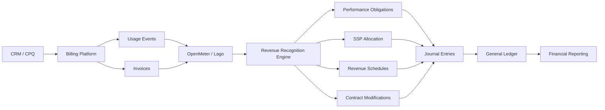

# Awesome-Revenue-Recognition-Software

## 💰 Top Revenue Recognition Software

> A curated list of **Revenue Recognition, Revenue Accounting, Deferred Revenue, Contract Accounting, Subscription Revenue, ASC 606, IFRS 15, SSP Allocation, Revenue Scheduling, and Revenue Automation platforms** — with a strong emphasis on **open-source and self-hosted alternatives**.

Revenue recognition software automates the accounting treatment of customer contracts, subscriptions, invoices, performance obligations, deferred revenue, contract modifications, standalone selling price (SSP) allocation, revenue schedules, journal entries, and financial reporting.

This repository focuses particularly on companies looking for **open-source building blocks or self-hosted alternatives** to proprietary platforms such as **Leapfin, Zenskar, Sequence, Softrax, RightRev, Chargebee RevRec, Zuora Revenue, Maxio, Sage Intacct RevRec, Oracle Revenue Management, HubiFi, Trullion, and NetSuite ARM**.

> **Important:** There are currently far fewer mature open-source products that provide a complete drop-in replacement for enterprise revenue-recognition suites. The open-source ecosystem is therefore divided into:
>
> 1. **Direct revenue-recognition/accounting platforms**
> 2. **Open-source ERP/accounting systems with deferred-revenue functionality**
> 3. **Open-source billing and monetization platforms**
> 4. **Revenue-recognition calculation engines and reference implementations**
> 5. **Data, workflow, reporting, and infrastructure components** for building a complete self-hosted RevRec platform

---

## 📑 Table of Contents

* [🏢 SaaS/Hosted Platforms](#-saashosted-platforms)
* [💻 Open-Source](#-open-source)

  * [Direct Revenue Recognition / Accounting](#1-direct-revenue-recognition--accounting)
  * [Open-Source ERP & Accounting](#2-open-source-erp--accounting)
  * [Open-Source Billing & Monetization](#3-open-source-billing--monetization)
  * [Revenue Recognition Engines & Projects](#4-revenue-recognition-engines--projects)
  * [Invoicing & Receivables](#5-invoicing--receivables)
  * [Data & Workflow Infrastructure](#6-data--workflow-infrastructure)
  * [Analytics & Reporting](#7-analytics--reporting)
  * [AI / Document Processing](#8-ai--document-processing)
* [🔄 Commercial → Open-Source Mapping](#-commercial--open-source-mapping)
* [🏗️ Reference Architectures](#️-reference-architectures)
* [📊 Revenue Recognition Workflow](#-revenue-recognition-workflow)
* [🧮 Revenue Recognition Model](#-revenue-recognition-model)
* [📋 Capability Matrix](#-capability-matrix)
* [⭐ Recommended Open-Source Stacks](#-recommended-open-source-stacks)
* [🎯 Closest Open-Source Alternatives](#-closest-open-source-alternatives)
* [⚠️ What Open Source Can and Cannot Replace](#️-what-open-source-can-and-cannot-replace)
* [🔐 Security, Audit & Compliance](#-security-audit--compliance)
* [📜 Licensing](#-licensing)
* [🚀 Building a Self-Hosted Revenue Recognition Platform](#-building-a-self-hosted-revenue-recognition-platform)
* [📈 Future Open-Source Opportunity](#-future-open-source-opportunity)
* [🤝 Contributing](#-contributing)
* [⚠️ Disclaimer](#️-disclaimer)

---

# 🏢 SaaS/Hosted Platforms

These are commercial platforms that provide dedicated revenue-recognition, revenue-accounting, billing, subscription, or financial-management capabilities.

| Platform                                                                                  | Primary Strength            | Typical Use Case                            |
| ----------------------------------------------------------------------------------------- | --------------------------- | ------------------------------------------- |
| [Leapfin](https://www.leapfin.com/)                                                       | Revenue automation          | High-volume SaaS and transaction businesses |
| [Zenskar](https://www.zenskar.com/)                                                       | Billing + revenue           | Complex usage and subscription models       |
| [Sequence](https://www.sequencehq.com/)                                                   | Billing / monetization      | Modern SaaS and usage-based businesses      |
| [Softrax](https://www.softrax.com/)                                                       | Revenue management          | Enterprise revenue automation               |
| [RightRev](https://www.rightrev.com/)                                                     | Revenue recognition         | ASC 606 / IFRS 15                           |
| [Chargebee RevRec](https://www.chargebee.com/revrec/)                                     | Subscription revenue        | SaaS/subscription companies                 |
| [Zuora Revenue](https://www.zuora.com/products/revenue/)                                  | Enterprise RevRec           | Complex subscription businesses             |
| [Maxio](https://www.maxio.com/)                                                           | SaaS finance                | Subscription finance and RevRec             |
| [Sage Intacct](https://www.sage.com/en-us/products/sage-intacct/)                         | Financial management        | Mid-market accounting                       |
| [Oracle Revenue Management](https://www.oracle.com/erp/financials/revenue-management/)    | Enterprise revenue          | Large enterprises                           |
| [Oracle NetSuite ARM](https://www.netsuite.com/)                                          | Advanced Revenue Management | ERP-integrated RevRec                       |
| [HubiFi](https://www.hubifi.com/)                                                         | Revenue automation          | Transaction-heavy businesses                |
| [Trullion](https://trullion.com/)                                                         | AI revenue accounting       | Contract and revenue accounting             |
| [Certinia](https://www.certinia.com/)                                                     | ERP + RevRec                | Professional services                       |
| [Workday Revenue Management](https://www.workday.com/)                                    | Enterprise finance          | Large organizations                         |
| [SAP Revenue Accounting and Reporting](https://www.sap.com/)                              | Enterprise RevRec           | SAP environments                            |
| [Microsoft Dynamics 365 Finance](https://www.microsoft.com/dynamics-365/products/finance) | Financial accounting        | Enterprise ERP                              |
| [Salesforce Revenue Cloud](https://www.salesforce.com/)                                   | Quote-to-cash               | Salesforce-centric organizations            |
| [Stripe Billing](https://stripe.com/billing)                                              | Billing infrastructure      | SaaS and internet businesses                |
| [Recurly](https://recurly.com/)                                                           | Subscription billing        | Recurring-revenue businesses                |
| [Ordway](https://ordwaylabs.com/)                                                         | Billing + RevRec            | Complex billing                             |
| [Chargezoom](https://www.chargezoom.com/)                                                 | Billing / AR                | SMB and mid-market                          |
| [BillingPlatform](https://billingplatform.com/)                                           | Enterprise billing          | Complex monetization                        |
| [Moesif](https://www.moesif.com/)                                                         | Usage analytics             | API/usage businesses                        |
| [Maxio RevRec](https://www.maxio.com/)                                                    | SaaS revenue recognition    | B2B SaaS                                    |
| [Softrax Revenue Management](https://www.softrax.com/)                                    | Contract revenue            | Enterprise RevRec                           |
| [Zuora Billing](https://www.zuora.com/products/billing/)                                  | Subscription billing        | Enterprise SaaS                             |
| [Zuora RevPro / Zuora Revenue](https://www.zuora.com/)                                    | Revenue accounting          | Complex contracts                           |
| [NetSuite Advanced Revenue Management](https://www.netsuite.com/)                         | ERP RevRec                  | NetSuite customers                          |

---

# 💻 Open-Source

> **Open-source is the primary focus of this repository.**
>
> A critical distinction is necessary: an open-source billing system is **not automatically an ASC 606/IFRS 15 revenue-recognition system**. Billing determines what is invoiced; revenue recognition determines **when and how revenue is earned and recorded**.
>
> The projects below are therefore grouped by how directly they can replace or contribute to a commercial RevRec platform.

---

# 1. Direct Revenue Recognition / Accounting

## 🥇 OpenBooks

**[OpenBooks](https://github.com/braedonsaunders/openbooks)**

Open-source business/financial-management platform with unusually strong revenue-accounting functionality.

### Relevant capabilities

* Revenue contracts
* Performance obligations
* Recognition schedules
* Point-in-time recognition
* Over-time recognition
* Catch-up entries
* Cancellation handling
* Recurring invoicing
* Subscription functionality
* Journal entries
* General ledger
* Audit controls
* ASC 606 / IFRS 15 conformance work
* Standards-conformance testing

> OpenBooks is particularly interesting for this repository because it is one of the few open-source projects explicitly incorporating **revenue contracts, performance obligations and recognition schedules** rather than merely providing invoicing.

**GitHub:**
https://github.com/braedonsaunders/openbooks

**Status:** Alpha — evaluate carefully before production financial use.

---

## 🥈 Odoo Community

**[Odoo](https://github.com/odoo/odoo)**

Odoo Community provides accounting functionality and supports deferred revenue schedules.

### Revenue capabilities

* Deferred revenue
* Revenue models
* Revenue schedules
* Automatic journal entries
* Periodic recognition
* Prorated recognition
* Deferred revenue reporting
* Multi-company accounting
* Invoicing
* Contracts
* Subscriptions through relevant modules
* General ledger

Odoo's accounting documentation explicitly supports spreading deferred revenue across future periods and generating recognition entries automatically.

**GitHub:**
https://github.com/odoo/odoo

**Best for:** ERP-centric revenue recognition.

---

## 🥉 ERPNext

**[ERPNext](https://github.com/frappe/erpnext)**

ERPNext is a fully open-source ERP with accounting and deferred-revenue functionality.

### Relevant capabilities

* Deferred revenue
* Service periods
* Day/month-based allocation
* Automated recognition
* Journal entries
* General ledger
* Sales invoices
* Subscriptions
* Accounts receivable
* Multi-company accounting
* Financial reporting
* REST API

ERPNext documentation provides a dedicated deferred-revenue workflow with service dates, deferred-revenue liabilities and automated recognition.

**GitHub:**
https://github.com/frappe/erpnext

---

## Tryton

**[Tryton](https://github.com/tryton/tryton)**

Modular open-source ERP platform with a strong accounting foundation.

### Relevant components

* Double-entry accounting
* General ledger
* Accounts receivable
* Accounts payable
* Sales
* Invoicing
* Financial reporting
* Modular accounting extensions

**GitHub:**
https://github.com/tryton/tryton

---

## Dolibarr

**[Dolibarr](https://github.com/Dolibarr/dolibarr)**

Open-source ERP/CRM platform useful as the accounting and invoicing layer in a custom RevRec architecture.

### Relevant capabilities

* Accounting
* Invoicing
* Orders
* Contracts
* Recurring services
* Payments
* Financial reporting
* APIs
* Extensible modules

**GitHub:**
https://github.com/Dolibarr/dolibarr

---

# 2. Open-Source ERP & Accounting

These platforms can form the **general-ledger/accounting layer** beneath a custom revenue-recognition engine.

| Project                                                          | Accounting | Invoicing | Contracts | RevRec Potential | License    |
| ---------------------------------------------------------------- | ---------: | --------: | --------: | ---------------: | ---------- |
| [ERPNext](https://github.com/frappe/erpnext)                     |          ✅ |         ✅ |         ✅ |             ⭐⭐⭐⭐ | GPL        |
| [Odoo Community](https://github.com/odoo/odoo)                   |          ✅ |         ✅ |         ✅ |             ⭐⭐⭐⭐ | LGPL       |
| [Tryton](https://github.com/tryton/tryton)                       |          ✅ |         ✅ |         ✅ |              ⭐⭐⭐ | GPL        |
| [Dolibarr](https://github.com/Dolibarr/dolibarr)                 |          ✅ |         ✅ |         ✅ |              ⭐⭐⭐ | GPL        |
| [Apache OFBiz](https://github.com/apache/ofbiz-framework)        |          ✅ |         ✅ |         ✅ |              ⭐⭐⭐ | Apache-2.0 |
| [ERP5](https://www.erp5.com/)                                    |          ✅ |         ✅ |         ✅ |              ⭐⭐⭐ | GPL        |
| [iDempiere](https://github.com/idempiere/idempiere)              |          ✅ |         ✅ |         ✅ |              ⭐⭐⭐ | GPL        |
| [ADempiere](https://github.com/adempiere/adempiere)              |          ✅ |         ✅ |         ✅ |              ⭐⭐⭐ | GPL        |
| [metasfresh](https://github.com/metasfresh/metasfresh)           |          ✅ |         ✅ |         ✅ |              ⭐⭐⭐ | GPL        |
| [Axelor Open Suite](https://github.com/axelor/axelor-open-suite) |          ✅ |         ✅ |         ✅ |              ⭐⭐⭐ | AGPL       |
| [LedgerSMB](https://github.com/ledgersmb/LedgerSMB)              |          ✅ |         ✅ |   Limited |               ⭐⭐ | GPL        |
| [FrontAccounting](https://github.com/FrontAccountingERP/FA)      |          ✅ |         ✅ |   Limited |               ⭐⭐ | GPL        |
| [GnuCash](https://github.com/Gnucash/gnucash)                    |          ✅ |   Limited |   Limited |                ⭐ | GPL        |

---

# 3. Open-Source Billing & Monetization

Billing is one of the most important inputs into a revenue-recognition system.

These projects can supply:

* Customers
* Contracts
* Products
* Subscriptions
* Usage
* Prices
* Discounts
* Invoices
* Credit notes
* Payments
* Billing events

## Kill Bill

**[Kill Bill](https://github.com/killbill/killbill)**

One of the most mature open-source subscription-billing platforms.

### Features

* Subscription billing
* Recurring billing
* Usage billing
* Invoices
* Payments
* Credits
* Billing events
* APIs
* Plugin architecture
* Financial reporting
* Extensible business logic

**License:** Apache-2.0

Kill Bill is particularly useful as the **billing/event source** feeding a custom revenue-recognition engine.

---

## Lago

**[Lago](https://github.com/getlago/lago)**

Open-source metering and usage-based billing platform.

### Features

* Usage metering
* Subscription billing
* Hybrid pricing
* Usage-based pricing
* Invoicing
* Coupons
* Add-ons
* Prepaid credits
* Billing APIs
* Self-hosting

**License:** AGPL-3.0

**GitHub:**
https://github.com/getlago/lago

---

## OpenMeter

**[OpenMeter](https://github.com/openmeterio/openmeter)**

Open-source metering and billing infrastructure particularly suited to:

* AI
* APIs
* DevTools
* Usage-based SaaS
* Consumption billing

### Features

* Real-time metering
* CloudEvents
* Usage aggregation
* Product catalog
* Subscription management
* Usage-based billing
* Credits
* Entitlements
* Invoice generation
* Webhooks
* API/SDK integration

**License:** Apache-2.0

**GitHub:**
https://github.com/openmeterio/openmeter

---

## Meteroid

**[Meteroid](https://github.com/meteroid-oss/meteroid)**

Open-source pricing and billing infrastructure.

### Features

* Usage metering
* Pricing
* Subscription management
* Quotes
* Invoicing
* Credit notes
* Usage-based billing
* Hybrid pricing
* Customer portal
* Billing analytics
* Accounting integrations

**License:** AGPL-3.0

---

## Other Open-Source Billing Platforms

| Project                                                      | Primary Role                   |
| ------------------------------------------------------------ | ------------------------------ |
| [Kill Bill](https://github.com/killbill/killbill)            | Subscription billing           |
| [Lago](https://github.com/getlago/lago)                      | Usage-based billing            |
| [OpenMeter](https://github.com/openmeterio/openmeter)        | Metering + billing             |
| [Meteroid](https://github.com/meteroid-oss/meteroid)         | Monetization + billing         |
| [Apache OFBiz](https://github.com/apache/ofbiz-framework)    | ERP + order/billing            |
| [ERPNext](https://github.com/frappe/erpnext)                 | ERP + subscriptions/accounting |
| [Odoo](https://github.com/odoo/odoo)                         | ERP + subscriptions/accounting |
| [Dolibarr](https://github.com/Dolibarr/dolibarr)             | ERP + invoicing                |
| [InvoiceShelf](https://github.com/InvoiceShelf/InvoiceShelf) | Invoicing                      |
| [Akaunting](https://github.com/akaunting/akaunting)          | Accounting + invoicing         |
| [InvoicePlane](https://github.com/InvoicePlane/InvoicePlane) | Invoicing                      |
| [Crater](https://github.com/crater-invoice-inc/crater)       | Invoicing                      |
| [Solidus](https://github.com/solidusio/solidus)              | Commerce                       |
| [Saleor](https://github.com/saleor/saleor)                   | Commerce                       |
| [Medusa](https://github.com/medusajs/medusa)                 | Commerce                       |

---

# 4. Revenue Recognition Engines & Projects

A smaller but strategically important category is **actual revenue-recognition calculation code**.

## OpenBooks Revenue Engine

The OpenBooks project is notable because its accounting model explicitly includes:

* Revenue contracts
* Performance obligations
* Recognition schedules
* Point-in-time recognition
* Over-time recognition
* Catch-up accounting
* Cancellation handling
* ASC 606 / IFRS 15 conformance tests

**Repository:**
https://github.com/braedonsaunders/openbooks

---

## Revenue Recognition — C#

**[jonsb/revenue-recognition](https://github.com/jonsb/revenue-recognition)**

A C# implementation based on revenue-recognition examples from Martin Fowler's *Patterns of Enterprise Application Architecture*.

Useful primarily as:

* Educational material
* Domain-model reference
* Revenue-recognition logic example
* Software architecture reference

It should **not** be treated as a production ASC 606 engine.

---

## OpenAccountants

**[OpenAccountants](https://github.com/openaccountants/openaccountants)**

Open accounting knowledge and automation project containing financial-reporting material covering:

* IFRS 15
* ASC 606
* Performance obligations
* Variable consideration
* Contract modifications
* Contract assets
* Contract liabilities
* Refund liabilities

Useful as a **knowledge/policy layer** for a custom RevRec engine.

---

# 5. Invoicing & Receivables

These projects are useful when the objective is to build an end-to-end open-source revenue stack.

## InvoiceShelf

**[InvoiceShelf](https://github.com/InvoiceShelf/InvoiceShelf)**

Open-source invoicing platform.

### Features

* Invoices
* Estimates
* Customers
* Payments
* Expenses
* Recurring invoices
* REST/API capabilities
* Self-hosting

**License:** AGPL-3.0

---

## Akaunting

**[Akaunting](https://github.com/akaunting/akaunting)**

Open-source accounting and invoicing platform.

### Useful components

* Accounting
* Invoicing
* Payments
* Expenses
* Customers
* Vendors
* Financial reports
* REST API
* Modular architecture

---

## InvoicePlane

**[InvoicePlane](https://github.com/InvoicePlane/InvoicePlane)**

Self-hosted invoicing platform suitable as a lightweight billing source.

---

## Crater

**[Crater](https://github.com/crater-invoice-inc/crater)**

Open-source invoicing application useful for smaller implementations.

---

# 6. Data & Workflow Infrastructure

A production-grade open-source RevRec system normally needs a data and orchestration layer.

## Workflow

| Project                                               | Role                        |
| ----------------------------------------------------- | --------------------------- |
| [n8n](https://github.com/n8n-io/n8n)                  | Workflow automation         |
| [Node-RED](https://github.com/node-red/node-red)      | Event workflows             |
| [Windmill](https://github.com/windmill-labs/windmill) | Developer workflows         |
| [Temporal](https://github.com/temporalio/temporal)    | Durable workflows           |
| [Kestra](https://github.com/kestra-io/kestra)         | Data/workflow orchestration |
| [Apache Airflow](https://github.com/apache/airflow)   | Data pipelines              |
| [Dagster](https://github.com/dagster-io/dagster)      | Data orchestration          |
| [Prefect](https://github.com/PrefectHQ/prefect)       | Workflow orchestration      |

---

## Databases

| Project                                                | Role                       |
| ------------------------------------------------------ | -------------------------- |
| [PostgreSQL](https://github.com/postgres/postgres)     | Primary financial database |
| [MySQL](https://github.com/mysql/mysql-server)         | Transaction database       |
| [MariaDB](https://github.com/MariaDB/server)           | Open relational DB         |
| [ClickHouse](https://github.com/ClickHouse/ClickHouse) | Revenue analytics          |
| [DuckDB](https://github.com/duckdb/duckdb)             | Embedded analytics         |
| [SQLite](https://github.com/sqlite/sqlite)             | Lightweight storage        |
| [Redis](https://github.com/redis/redis)                | Cache/event support        |

---

## Event Streaming

| Project                                                 | Role                       |
| ------------------------------------------------------- | -------------------------- |
| [Apache Kafka](https://github.com/apache/kafka)         | Revenue event streaming    |
| [Apache Pulsar](https://github.com/apache/pulsar)       | Event streaming            |
| [NATS](https://github.com/nats-io/nats-server)          | Lightweight messaging      |
| [Redpanda](https://github.com/redpanda-data/redpanda)   | Kafka-compatible streaming |
| [RabbitMQ](https://github.com/rabbitmq/rabbitmq-server) | Messaging                  |

---

# 7. Analytics & Reporting

A self-hosted RevRec platform requires strong reporting for:

* Deferred revenue
* Recognized revenue
* Contract liabilities
* Revenue waterfall
* Remaining performance obligations
* Monthly recurring revenue
* ARR
* Cohort revenue
* Revenue by product
* Revenue by contract
* Revenue by entity
* Revenue by geography
* Revenue forecast
* Audit reconciliation

## Metabase

**[Metabase](https://github.com/metabase/metabase)**

Excellent for finance dashboards and operational RevRec reporting.

---

## Apache Superset

**[Apache Superset](https://github.com/apache/superset)**

Powerful open-source BI platform.

---

## Grafana

**[Grafana](https://github.com/grafana/grafana)**

Useful for:

* Revenue pipelines
* Data freshness
* Processing monitoring
* Recognition-job monitoring
* System observability

---

## Apache Pinot

**[Apache Pinot](https://github.com/apache/pinot)**

Useful for high-volume revenue analytics.

---

## OpenSearch

**[OpenSearch](https://github.com/opensearch-project/OpenSearch)**

Useful for searchable financial events, audit logs and operational analytics.

---

# 8. AI / Document Processing

AI can be used to extract contractual information before the RevRec engine determines accounting treatment.

## OCR

* [Tesseract](https://github.com/tesseract-ocr/tesseract)
* [PaddleOCR](https://github.com/PaddlePaddle/PaddleOCR)
* [OCRmyPDF](https://github.com/ocrmypdf/OCRmyPDF)

## Computer Vision

* [OpenCV](https://github.com/opencv/opencv)
* [Open3D](https://github.com/isl-org/Open3D)

## AI / LLM

* [Ollama](https://github.com/ollama/ollama)
* [vLLM](https://github.com/vllm-project/vllm)
* [llama.cpp](https://github.com/ggml-org/llama.cpp)
* [Hugging Face Transformers](https://github.com/huggingface/transformers)
* [LangChain](https://github.com/langchain-ai/langchain)
* [LlamaIndex](https://github.com/run-llama/llama_index)

### Potential AI RevRec workflow

```text
Contract PDF
    │
    ▼
OCR / Document Parser
    │
    ▼
Contract Extraction
    │
    ├── Customer
    ├── Products
    ├── Dates
    ├── Prices
    ├── Discounts
    ├── Renewal Terms
    ├── Termination
    └── Performance Obligations
    │
    ▼
Revenue Recognition Rules
    │
    ▼
Recognition Engine
    │
    ▼
Revenue Schedule
    │
    ▼
Journal Entries
    │
    ▼
General Ledger
```

---

# 🔄 Commercial → Open-Source Mapping

| Commercial Platform           | Closest Open-Source Strategy                     |
| ----------------------------- | ------------------------------------------------ |
| **Leapfin**                   | OpenBooks + PostgreSQL + Airflow                 |
| **Zenskar**                   | Lago / Meteroid / OpenMeter + OpenBooks          |
| **Sequence**                  | OpenMeter + Lago + custom RevRec engine          |
| **Softrax**                   | OpenBooks + ERPNext/Odoo                         |
| **RightRev**                  | OpenBooks + custom ASC 606 engine                |
| **Chargebee RevRec**          | Lago/Kill Bill + OpenBooks/ERPNext               |
| **Zuora Revenue**             | OpenMeter/Lago + custom RevRec + ERP             |
| **Maxio**                     | Lago + ERPNext + custom revenue schedules        |
| **Sage Intacct RevRec**       | ERPNext / Odoo + custom RevRec                   |
| **Oracle Revenue Management** | OpenBooks + PostgreSQL + Kafka + workflow engine |
| **HubiFi**                    | Kafka + PostgreSQL + OpenBooks + dbt             |
| **Trullion**                  | OCR + LLM + OpenBooks + PostgreSQL               |
| **NetSuite ARM**              | ERPNext/Odoo + OpenBooks                         |
| **Custom RevRec SaaS**        | OpenBooks + OpenMeter + PostgreSQL               |

---

# 🏗️ Reference Architectures

## Architecture 1 — Simple Open-Source RevRec


---

## Architecture 2 — SaaS Revenue Recognition



---

# 📊 Revenue Recognition Workflow

```text
1. Contract Creation
        │
        ▼
2. Identify Customer & Contract
        │
        ▼
3. Identify Performance Obligations
        │
        ▼
4. Determine Transaction Price
        │
        ▼
5. Allocate Transaction Price
        │
        ▼
6. Determine Recognition Pattern
        │
        ├── Point-in-Time
        │
        └── Over-Time
        │
        ▼
7. Generate Revenue Schedule
        │
        ▼
8. Generate Journal Entries
        │
        ▼
9. Post to General Ledger
        │
        ▼
10. Reconcile
        │
        ▼
11. Financial Reporting
```

---

# 🧮 Revenue Recognition Model

A generalized ASC 606 / IFRS 15 engine can be represented as:

```text
Contract
   │
   ├── Customer
   ├── Contract Start
   ├── Contract End
   ├── Products
   ├── Pricing
   ├── Discounts
   └── Modifications
        │
        ▼
Performance Obligations
        │
        ▼
Transaction Price
        │
        ▼
SSP Allocation
        │
        ▼
Recognition Method
        │
        ├── Point-in-Time
        ├── Straight-Line
        ├── Usage-Based
        ├── Milestone
        ├── Output Method
        └── Input Method
        │
        ▼
Revenue Schedule
        │
        ▼
Journal Entries
```

---

# 📋 Capability Matrix

| Capability              | OpenBooks | Odoo | ERPNext | Kill Bill | Lago | OpenMeter | Custom Engine |
| ----------------------- | --------: | ---: | ------: | --------: | ---: | --------: | ------------: |
| General Ledger          |         ✅ |    ✅ |       ✅ |        ⚠️ |    ❌ |         ❌ |         Build |
| Invoicing               |         ✅ |    ✅ |       ✅ |         ✅ |    ✅ |         ✅ |         Build |
| Subscriptions           |         ✅ |    ✅ |       ✅ |         ✅ |    ✅ |         ✅ |         Build |
| Usage Billing           |        ⚠️ |   ⚠️ |      ⚠️ |         ✅ |    ✅ |         ✅ |         Build |
| Deferred Revenue        |         ✅ |    ✅ |       ✅ |        ⚠️ |   ⚠️ |        ⚠️ |         Build |
| Revenue Schedules       |         ✅ |    ✅ |       ✅ |        ⚠️ |   ⚠️ |        ⚠️ |         Build |
| Performance Obligations |         ✅ |   ⚠️ |      ⚠️ |         ❌ |    ❌ |         ❌ |         Build |
| SSP Allocation          |        ⚠️ |   ⚠️ |      ⚠️ |         ❌ |    ❌ |         ❌ |         Build |
| Contract Modification   |        ⚠️ |   ⚠️ |      ⚠️ |        ⚠️ |   ⚠️ |        ⚠️ |         Build |
| Catch-Up Entries        |         ✅ |   ⚠️ |      ⚠️ |         ❌ |    ❌ |         ❌ |         Build |
| ASC 606 Engine          |        ⚠️ |   ⚠️ |      ⚠️ |         ❌ |    ❌ |         ❌ |         Build |
| IFRS 15 Engine          |        ⚠️ |   ⚠️ |      ⚠️ |         ❌ |    ❌ |         ❌ |         Build |
| Journal Entries         |         ✅ |    ✅ |       ✅ |        ⚠️ |   ⚠️ |        ⚠️ |         Build |
| Audit Trail             |         ✅ |    ✅ |       ✅ |         ✅ |    ✅ |         ✅ |         Build |
| API                     |         ✅ |    ✅ |       ✅ |         ✅ |    ✅ |         ✅ |         Build |
| Self-Hosted             |         ✅ |    ✅ |       ✅ |         ✅ |    ✅ |         ✅ |             ✅ |

> `⚠️` indicates that the capability may require configuration, customization, an extension, or a separate component.

---

# ⭐ Recommended Open-Source Stacks

## 🥇 Stack A — Maximum Accounting Coverage

```text
ERPNext
   +
OpenBooks
   +
PostgreSQL
   +
Airflow
   +
Metabase
```

### Best for

* Finance departments
* SaaS companies
* Contract accounting
* Deferred revenue
* Custom revenue schedules
* Self-hosted accounting

---

## 🥈 Stack B — Modern Usage-Based SaaS

```text
OpenMeter
     +
PostgreSQL / ClickHouse
     +
Custom RevRec Engine
     +
OpenBooks
     +
Metabase
```

### Best for

* AI companies
* API businesses
* Usage-based SaaS
* Token-based pricing
* Consumption billing

---

## 🥉 Stack C — Subscription SaaS

```text
Kill Bill
   +
PostgreSQL
   +
Revenue Recognition Engine
   +
ERPNext
   +
Metabase
```

### Best for

* Recurring subscriptions
* Complex billing
* Large customer bases
* Multiple billing models

---

## Stack D — Fully Open-Source Modern Monetization

```text
OpenMeter
      │
      ▼
Kafka
      │
      ▼
Revenue Recognition Engine
      │
      ├── Contract Engine
      ├── SSP Engine
      ├── Allocation Engine
      ├── Schedule Engine
      └── Journal Engine
      │
      ▼
PostgreSQL
      │
      ▼
ERPNext / OpenBooks
      │
      ▼
Metabase
```

---

# 🎯 Closest Open-Source Alternatives

## Alternative to Leapfin

### Recommended

```text
OpenBooks
+
PostgreSQL
+
Airflow
+
Metabase
```

Best suited for transaction transformation and revenue-accounting automation.

---

## Alternative to Zenskar

### Recommended

```text
OpenMeter
+
Lago
+
OpenBooks
```

Particularly strong for:

* Usage billing
* Hybrid pricing
* Subscription monetization
* Revenue automation

---

## Alternative to Chargebee RevRec

### Recommended

```text
Lago
+
OpenBooks
+
ERPNext
```

---

## Alternative to Zuora Revenue

### Recommended

```text
OpenMeter / Kill Bill
          +
Custom Revenue Engine
          +
OpenBooks / ERPNext
          +
PostgreSQL
```

This is a **platform architecture rather than a single drop-in replacement**.

---

## Alternative to NetSuite ARM

### Recommended

```text
ERPNext
+
OpenBooks
+
Custom Revenue Recognition Module
```

---

## Alternative to RightRev

### Recommended

```text
OpenBooks
+
Custom ASC 606 Engine
+
PostgreSQL
+
Metabase
```

---

## Alternative to Trullion

### Recommended

```text
Tesseract / PaddleOCR
        +
LLM
        +
Contract Extraction
        +
OpenBooks
        +
Revenue Engine
```

---

# 🧩 Building Blocks for a Complete Open-Source RevRec Platform

A commercial platform such as Zuora Revenue or RightRev combines many functions into one product.

An open-source architecture can instead be assembled from specialized components.

| Layer                | Recommended Projects                    |
| -------------------- | --------------------------------------- |
| Contract ingestion   | OpenBooks / custom                      |
| OCR                  | Tesseract / PaddleOCR                   |
| AI extraction        | Ollama / vLLM / Transformers            |
| CRM                  | SuiteCRM / EspoCRM / Twenty             |
| CPQ                  | ERPNext / Odoo / custom                 |
| Billing              | Kill Bill / Lago / OpenMeter / Meteroid |
| Usage metering       | OpenMeter                               |
| Subscription billing | Kill Bill / Lago                        |
| Accounting           | ERPNext / Odoo / Tryton                 |
| Revenue schedules    | OpenBooks / custom                      |
| Revenue engine       | OpenBooks / custom                      |
| Workflow             | Temporal / Airflow / n8n                |
| Event bus            | Kafka / NATS                            |
| Database             | PostgreSQL                              |
| Analytics            | ClickHouse                              |
| BI                   | Metabase / Superset                     |
| Monitoring           | Grafana                                 |
| Identity             | Keycloak / Authentik                    |
| Object storage       | MinIO                                   |

---

# 🔐 Security, Audit & Compliance

A production revenue-recognition platform should provide:

### Data security

* Encryption at rest
* TLS
* Secret management
* RBAC
* MFA
* SSO
* Network segmentation
* Database encryption
* Backup encryption

### Accounting controls

* Immutable journal entries
* Period locking
* Approval workflows
* Audit trails
* Segregation of duties
* Reconciliation
* Journal-entry versioning
* Contract versioning
* Revenue schedule versioning

### Revenue controls

* Performance-obligation traceability
* SSP methodology documentation
* Allocation calculations
* Contract modification history
* Catch-up entries
* Cancellation handling
* Refund handling
* Credit memo handling
* Contract asset/liability reconciliation

### Audit architecture

```text
Source Transaction
      │
      ▼
Contract
      │
      ▼
Performance Obligation
      │
      ▼
Allocation
      │
      ▼
Recognition Schedule
      │
      ▼
Journal Entry
      │
      ▼
General Ledger
      │
      ▼
Financial Statement
```

Every step should be traceable.

---

# 📜 Licensing

Open-source licensing varies substantially.

| License               | Examples                                |
| --------------------- | --------------------------------------- |
| Apache-2.0            | Kill Bill, OpenMeter                    |
| AGPL-3.0              | Lago, Meteroid, InvoiceShelf            |
| GPL                   | ERPNext, Dolibarr, Tryton               |
| LGPL                  | Odoo Community                          |
| Proprietary/Open-Core | Some projects and commercial extensions |

Before embedding any project into a commercial RevRec platform:

1. Check the exact repository license.
2. Check dependencies.
3. Check enterprise modules.
4. Check trademark restrictions.
5. Check hosted-service restrictions.
6. Check whether modifications must be disclosed.
7. Check compatibility with your distribution model.

---

# 🚀 Building a Self-Hosted Revenue Recognition Platform

A practical architecture can be implemented in stages.

## Phase 1 — Accounting Foundation

```text
ERPNext / Odoo
+
PostgreSQL
+
Metabase
```

Implement:

* Customers
* Products
* Invoices
* Payments
* Deferred revenue
* General ledger
* Financial reporting

---

## Phase 2 — Billing

Add:

```text
Kill Bill / Lago / OpenMeter
```

Implement:

* Subscriptions
* Usage
* Pricing
* Billing events
* Credit notes
* Invoices

---

## Phase 3 — Revenue Engine

Add:

```text
Revenue Recognition Service
```

Implement:

* Contracts
* Performance obligations
* Transaction price
* SSP
* Allocation
* Recognition patterns
* Revenue schedules
* Contract modifications
* Catch-up accounting
* Cancellations

---

## Phase 4 — Automation

Add:

```text
Kafka
+
Temporal / Airflow
+
n8n
```

Automate:

* Billing ingestion
* Contract ingestion
* Revenue calculations
* Monthly close
* Journal posting
* Reconciliation
* Exception management

---

## Phase 5 — AI

Add:

```text
OCR
+
LLM
+
Contract Parser
```

Automate:

* Contract extraction
* Performance-obligation identification
* Pricing extraction
* Renewal detection
* Modification detection
* Clause classification
* Revenue-policy suggestions

> AI should assist accounting decisions rather than silently determine accounting treatment without appropriate controls and review.

---

# 📈 Future Open-Source Opportunity

The biggest gap in the current open-source ecosystem is a **fully open-source, production-grade ASC 606 / IFRS 15 revenue-recognition engine**.

An ideal project would provide:

```text
                    ┌──────────────────────┐
                    │ Contract Management  │
                    └──────────┬───────────┘
                               │
                               ▼
                    ┌──────────────────────┐
                    │ Performance          │
                    │ Obligations          │
                    └──────────┬───────────┘
                               │
                               ▼
                    ┌──────────────────────┐
                    │ Transaction Price    │
                    └──────────┬───────────┘
                               │
                               ▼
                    ┌──────────────────────┐
                    │ SSP Allocation       │
                    └──────────┬───────────┘
                               │
                               ▼
                    ┌──────────────────────┐
                    │ Revenue Recognition  │
                    │ Rules Engine         │
                    └──────────┬───────────┘
                               │
                               ▼
                    ┌──────────────────────┐
                    │ Revenue Schedule     │
                    └──────────┬───────────┘
                               │
                               ▼
                    ┌──────────────────────┐
                    │ Journal Entries      │
                    └──────────┬───────────┘
                               │
                               ▼
                    ┌──────────────────────┐
                    │ General Ledger       │
                    └──────────┬───────────┘
                               │
                               ▼
                    ┌──────────────────────┐
                    │ Financial Reporting  │
                    └──────────────────────┘
```

### Ideal open-source RevRec engine features

* ASC 606
* IFRS 15
* Multiple performance obligations
* SSP allocation
* Relative SSP
* Residual allocation
* Variable consideration
* Contract modifications
* Contract combinations
* Terminations
* Refunds
* Credits
* Catch-up adjustments
* Point-in-time recognition
* Straight-line recognition
* Usage-based recognition
* Milestone recognition
* Output methods
* Input methods
* Multi-element arrangements
* Foreign currencies
* Multiple entities
* Multi-book accounting
* Versioned rules
* Audit trails
* Reconciliation
* Journal-entry generation
* API-first architecture
* Event-driven architecture

---

# 🧠 Suggested Open-Source Reference Stack

For organizations wanting the **closest practical open-source architecture to a modern RevRec platform**, the following combination is particularly attractive:

```text
                 ┌───────────────────┐
                 │ CRM / CPQ         │
                 │ Odoo / ERPNext    │
                 └─────────┬─────────┘
                           │
                           ▼
                 ┌───────────────────┐
                 │ Billing           │
                 │ Lago / Kill Bill  │
                 └─────────┬─────────┘
                           │
                           ▼
                 ┌───────────────────┐
                 │ Usage Metering    │
                 │ OpenMeter         │
                 └─────────┬─────────┘
                           │
                           ▼
              ┌─────────────────────────┐
              │ Revenue Recognition     │
              │ OpenBooks / Custom      │
              │ ASC 606 / IFRS 15       │
              │ Engine                  │
              └────────────┬────────────┘
                           │
                           ▼
                 ┌───────────────────┐
                 │ PostgreSQL        │
                 └─────────┬─────────┘
                           │
                           ▼
                 ┌───────────────────┐
                 │ ERP / General     │
                 │ Ledger            │
                 │ ERPNext / Odoo    │
                 └─────────┬─────────┘
                           │
                           ▼
                 ┌───────────────────┐
                 │ Metabase /        │
                 │ Superset          │
                 └───────────────────┘
```

---

# 🏆 Open-Source Shortlist

## Best Direct Revenue-Recognition Candidate

**[OpenBooks](https://github.com/braedonsaunders/openbooks)**

Best match for organizations specifically looking for open-source revenue contracts, performance obligations and recognition schedules.

---

## Best Open-Source ERP

**[ERPNext](https://github.com/frappe/erpnext)**

Strong accounting foundation with deferred-revenue functionality and broad ERP coverage.

---

## Best ERP Alternative

**[Odoo Community](https://github.com/odoo/odoo)**

Strong ecosystem and accounting/deferred-revenue capabilities.

---

## Best Subscription Billing

**[Kill Bill](https://github.com/killbill/killbill)**

Mature and highly extensible subscription-billing architecture.

---

## Best Usage-Based Billing

**[Lago](https://github.com/getlago/lago)**

Strong option for usage-based and hybrid SaaS billing.

---

## Best Modern Metering

**[OpenMeter](https://github.com/openmeterio/openmeter)**

Particularly attractive for AI, API and consumption-based businesses.

---

## Best Modern Monetization Stack

**[Meteroid](https://github.com/meteroid-oss/meteroid)**

Useful for product-led SaaS and complex usage-based monetization.

---

## Best Open-Source Analytics

**[Metabase](https://github.com/metabase/metabase)**

Simple and effective finance/RevRec dashboards.

---

# 🔬 Open-Source Maturity Ranking

| Category                                  | Maturity |
| ----------------------------------------- | -------: |
| Open-source ERP                           |    ⭐⭐⭐⭐⭐ |
| Open-source accounting                    |    ⭐⭐⭐⭐⭐ |
| Open-source invoicing                     |    ⭐⭐⭐⭐⭐ |
| Open-source subscription billing          |     ⭐⭐⭐⭐ |
| Open-source usage billing                 |     ⭐⭐⭐⭐ |
| Open-source metering                      |     ⭐⭐⭐⭐ |
| Open-source analytics                     |    ⭐⭐⭐⭐⭐ |
| Open-source workflow                      |    ⭐⭐⭐⭐⭐ |
| Open-source contract extraction           |      ⭐⭐⭐ |
| Open-source ASC 606 engine                |       ⭐⭐ |
| Open-source IFRS 15 engine                |       ⭐⭐ |
| Open-source SSP allocation                |       ⭐⭐ |
| Open-source enterprise RevRec replacement |       ⭐⭐ |

---

# 💡 Key Takeaway

There is currently **no universally mature open-source drop-in equivalent of Zuora Revenue, RightRev, Leapfin, Trullion, or NetSuite ARM**.

However, a highly capable self-hosted system can already be assembled from open-source components:

```text
ERPNext / Odoo
        +
OpenBooks
        +
Kill Bill / Lago / OpenMeter
        +
PostgreSQL
        +
Kafka
        +
Temporal / Airflow
        +
Metabase
        +
OCR / LLM
```

The most important missing layer is a **fully open, independently auditable ASC 606 / IFRS 15 calculation engine** covering performance obligations, SSP allocation, modifications, variable consideration and complex revenue schedules.

That represents one of the most promising opportunities for an open-source financial-software project.

---

# 🤝 Contributing

Contributions are welcome.

Please consider contributing:

* New open-source RevRec projects
* Revenue-recognition engines
* ERP modules
* ASC 606 implementations
* IFRS 15 implementations
* SSP allocation algorithms
* Contract-accounting libraries
* Billing engines
* Revenue waterfall tools
* Financial reporting tools
* Integration connectors
* Documentation
* Architecture examples
* Compliance test cases

### Suggested contribution format

```text
Project:
URL:
License:
Primary Language:
Self-hosted:
Revenue Recognition:
ASC 606:
IFRS 15:
Billing:
Deferred Revenue:
SSP Allocation:
Performance Obligations:
Production Ready:
Last Updated:
```

---

# ⚠️ Disclaimer

This repository is intended for **research, technology evaluation and architecture planning**.

Inclusion does not constitute an endorsement.

Open-source accounting and billing software may require substantial configuration or custom development before it is suitable for production financial reporting.

In particular:

* Billing ≠ revenue recognition
* Deferred revenue ≠ complete ASC 606 implementation
* An ERP ≠ dedicated RevRec engine
* An open-source project ≠ automatically audit-ready
* AI-generated accounting decisions require human review
* ASC 606 / IFRS 15 implementation should be validated by qualified accounting professionals

Always verify the current project status, license, documentation, implementation scope, security posture and accounting requirements before using any project for production financial reporting.

---

## ⭐ Final Recommended Open-Source Combination

```text
┌─────────────────────────────────────────────────────────────┐
│                    OPEN-SOURCE REVREC STACK                 │
├─────────────────────────────────────────────────────────────┤
│                                                             │
│  CRM / CPQ                                                  │
│       │                                                     │
│       ▼                                                     │
│  ERPNext / Odoo                                             │
│       │                                                     │
│       ▼                                                     │
│  Kill Bill / Lago / Meteroid                                │
│       │                                                     │
│       ▼                                                     │
│  OpenMeter                                                   │
│       │                                                     │
│       ▼                                                     │
│  ┌─────────────────────────────────────────────────────┐    │
│  │ Revenue Recognition Engine                         │    │
│  │                                                     │    │
│  │ Contract → PO → Transaction Price → SSP → Schedule │    │
│  │ → Recognition → Journal Entry                      │    │
│  └─────────────────────────────────────────────────────┘    │
│       │                                                     │
│       ▼                                                     │
│  OpenBooks / ERPNext / Odoo                                 │
│       │                                                     │
│       ▼                                                     │
│  PostgreSQL + Kafka + Temporal/Airflow                       │
│       │                                                     │
│       ▼                                                     │
│  Metabase / Superset                                         │
│                                                             │
└─────────────────────────────────────────────────────────────┘
```

**The strongest open-source strategy today is therefore not to search for a single clone of Zuora Revenue or RightRev, but to combine an open billing platform, an open accounting platform and an auditable revenue-recognition engine into a modular self-hosted RevRec stack.**

